---
## Front matter
lang: ru-RU
title: Отчёт по первому этапу индивидуального проекта.
subtitle: Размещение на Github pages заготовки для персонального сайта.
author:
  - Дельгадильо Валерия
institute:
  - Российский университет дружбы народов, Москва, Россия
  - Объединённый институт ядерных исследований, Дубна, Россия
date: 01 января 1970

## i18n babel
babel-lang: russian
babel-otherlangs: english

## Formatting pdf
toc: false
toc-title: Содержание
slide_level: 2
aspectratio: 169
section-titles: true
theme: metropolis
header-includes:
 - \metroset{progressbar=frametitle,sectionpage=progressbar,numbering=fraction}
 - '\makeatletter'
 - '\beamer@ignorenonframefalse'
 - '\makeatother'

---

# Информация

## Докладчик

  * Дельгадильо Валерия
  * Студент 1го курса НММбд-03-23
  * Российский университет дружбы народов
  * [1032229098@pfur.ru](mailto:1032229098@pfur.ru)
  * <https://github.com/yvdeljgadiljo/study_2023-2024_os-intro>

## Цели и задачи
Целью данной работы является размещение на Github pages заготовки для
персонального сайта.

# Выполнение лабораторной работы

## Скачаем исполняемый файл hugo (hugo_extended_0.123.6_Linux-64bit.tar.gz) для генерации страниц сайта.

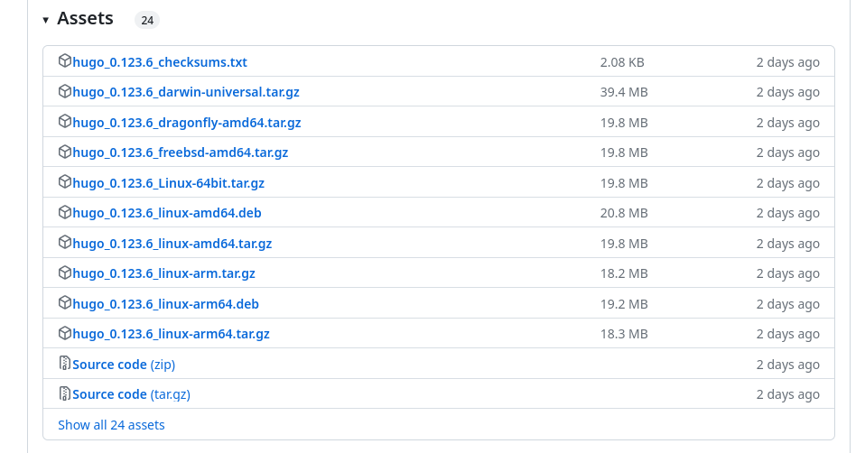

## Перейдём в "Загрузки", разархивируем файл и создадим папку "bin" с файлом hugo.

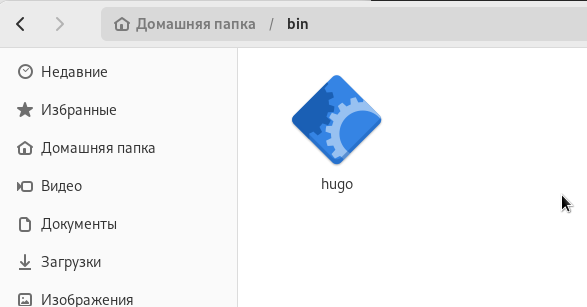

## Создадим репозиторий blog на основе шаблона.

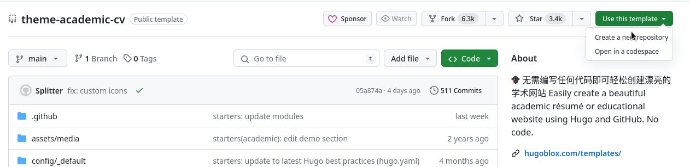

## Клонируем созданный репозиторий.

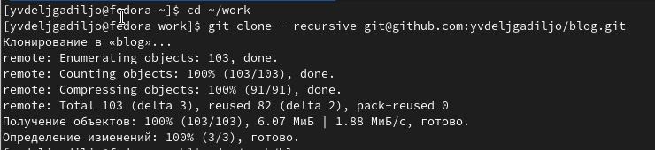

## Переходим в каталог "blog" и вводим в терминале \~/bin/hugo

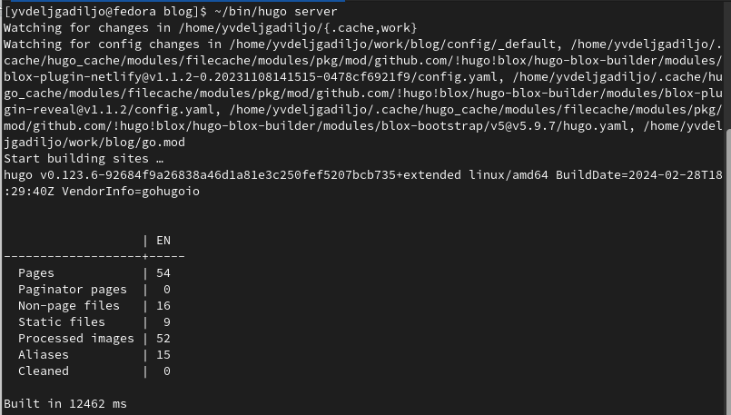

## Скопируем ссылку из предыдущего пункта и вставим её в браузер.

## Создадим репозиторий sshkiperr.github.io.

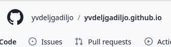

## Перейдем в терминал и клонируем созданный репозиторий.

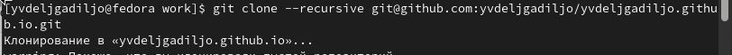

## Перейдем в созданный каталог и введем в терминале команду git checkout -b main, чтобы создать ветку.

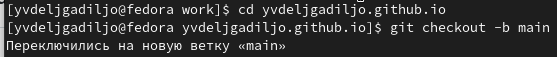

## Создадим файл, чтобы активировать созданный репозиторий.

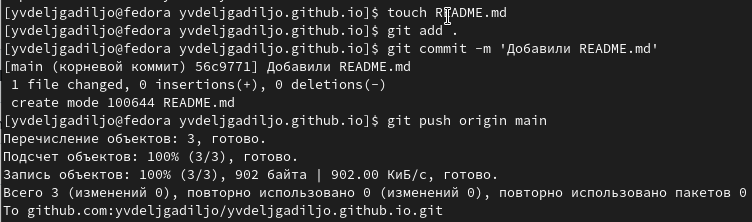

## Убедимся в том, что файл был создан.

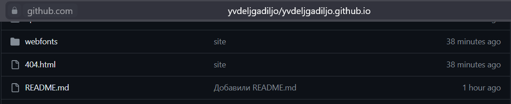

## Перейдем в каталог "blog" и введем в терминале команду git submodule add -b main git@github.com:godbyy/sshkiperr.github.io.git public, чтобы созданный репозиторий подключить к папке "public" внутри каталога "blog".

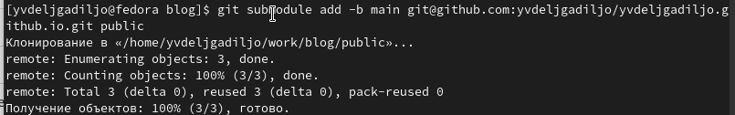

## Откроем в mc файл .gitignore и закомментирум public, сохраним изменения.

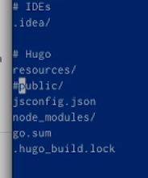

## Проверим изменение из предыдущего пункта.

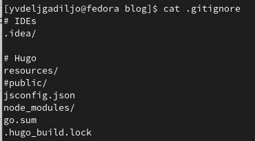

## Убедимся в том, что появилась папка "public".

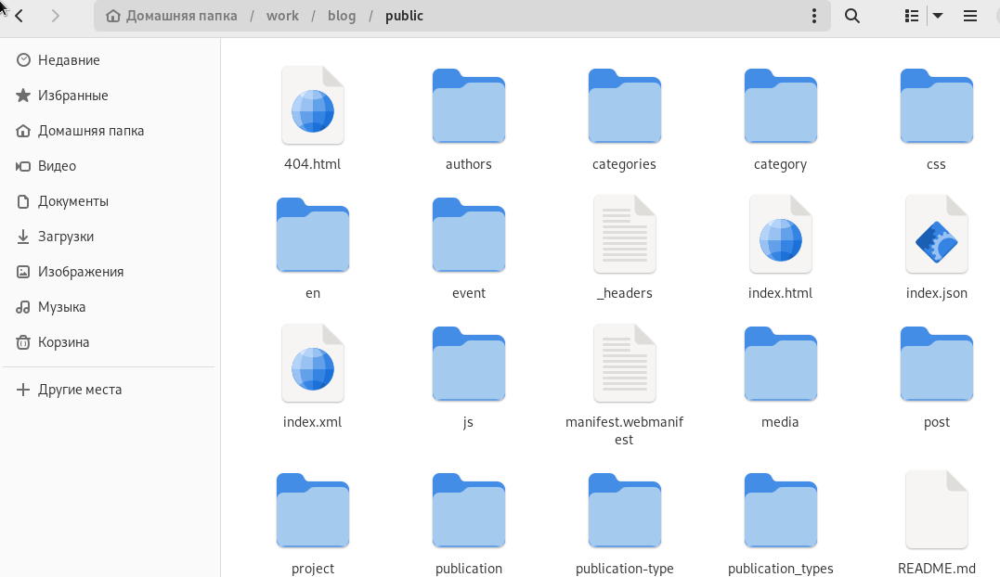

## Введем нужную команду, находясь в каталоге "blog", чтобы появились нужные файлы в папке "public".

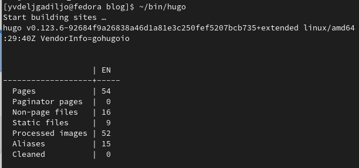

## Синхронизируем появившиеся файлы с репозиторием, перейдя в папку "public".

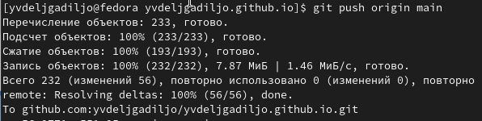

## Обновим репозиторий и проверим, что все файлы появились.

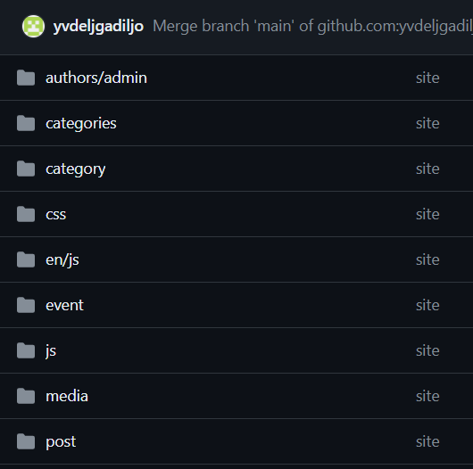

# Выводы
## Выводы
В ходе выполнения данной работы я разместила на Github pages заготовки
для персонального сайта. Первый этап индивидуального проекта завершён.
