---
## Front matter
title: "Отчёт по первому этапу индивидуального проекта."
subtitle: "Размещение на Github pages заготовки для персонального сайта."
author: "Валерия Дельгадильо"

## Generic otions
lang: ru-RU
toc-title: "Содержание"

## Bibliography
bibliography: bib/cite.bib
csl: pandoc/csl/gost-r-7-0-5-2008-numeric.csl

## Pdf output format
toc: true # Table of contents
toc-depth: 2
lof: true # List of figures
lot: true # List of tables
fontsize: 12pt
linestretch: 1.5
papersize: a4
documentclass: scrreprt
## I18n polyglossia
polyglossia-lang:
  name: russian
  options:
	- spelling=modern
	- babelshorthands=true
polyglossia-otherlangs:
  name: english
## I18n babel
babel-lang: russian
babel-otherlangs: english
## Fonts
mainfont: PT Serif
romanfont: PT Serif
sansfont: PT Sans
monofont: PT Mono
mainfontoptions: Ligatures=TeX
romanfontoptions: Ligatures=TeX
sansfontoptions: Ligatures=TeX,Scale=MatchLowercase
monofontoptions: Scale=MatchLowercase,Scale=0.9
## Biblatex
biblatex: true
biblio-style: "gost-numeric"
biblatexoptions:
  - parentracker=true
  - backend=biber
  - hyperref=auto
  - language=auto
  - autolang=other*
  - citestyle=gost-numeric
## Pandoc-crossref LaTeX customization
figureTitle: "Рис."
tableTitle: "Таблица"
listingTitle: "Листинг"
lofTitle: "Список иллюстраций"
lotTitle: "Список таблиц"
lolTitle: "Листинги"
## Misc options
indent: true
header-includes:
  - \usepackage{indentfirst}
  - \usepackage{float} # keep figures where there are in the text
  - \floatplacement{figure}{H} # keep figures where there are in the text
---

# Цель работы

Целью данной работы является размещение на Github pages заготовки для
персонального сайта.

# Задачи

1.  Установить необходимое программное обеспечение.
2.  Скачать шаблон темы сайта.
3.  Разместить его на хостинге git.
4.  Установить параметр для URLs сайта.
5.  Разместить заготовку сайта на Github pages.

# Выполнение работы

Скачаем исполняемый файл hugo
(hugo_extended_0.123.6_Linux-64bit.tar.gz) для генерации страниц
сайта.

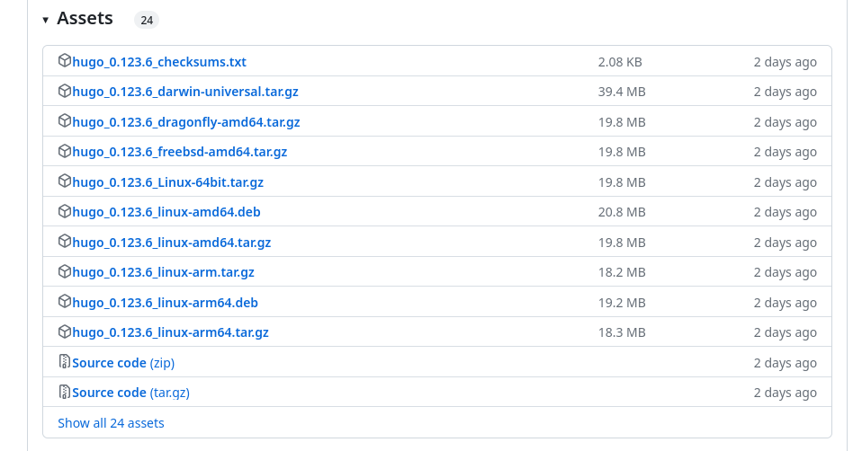

Перейдём в "Загрузки", разархивируем файл и создадим папку "bin" с
файлом hugo.

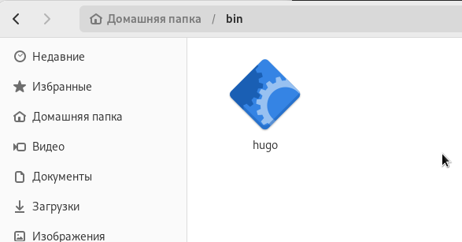

Создадим репозиторий blog на основе шаблона.

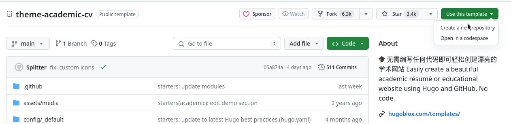

Клонируем созданный репозиторий.

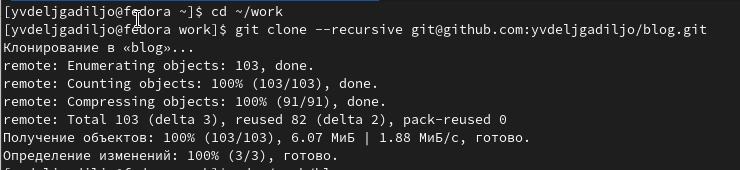

Переходим в каталог "blog" и вводим в терминале \~/bin/hugo

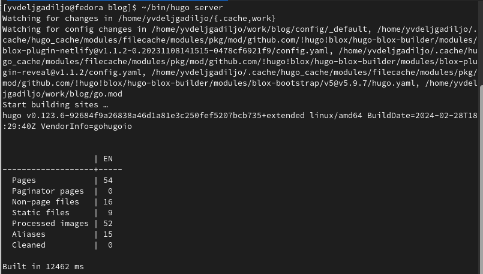

Скопируем ссылку из предыдущего пункта и вставим её в браузер.

Создадим репозиторий sshkiperr.github.io.

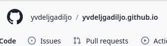

Перейдем в терминал и клонируем созданный репозиторий.

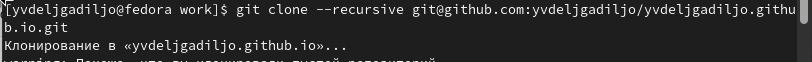

Перейдем в созданный каталог и введем в терминале команду git
checkout -b main, чтобы создать ветку.

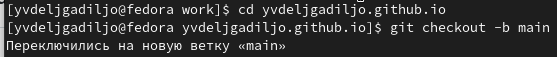

Создадим файл, чтобы активировать созданный репозиторий.

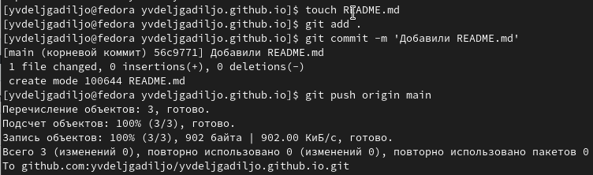

Убедимся в том, что файл был создан.

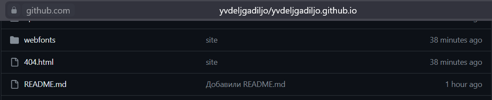

Перейдем в каталог "blog" и введем в терминале команду git submodule
add -b main git@github.com:godbyy/sshkiperr.github.io.git public,
чтобы созданный репозиторий подключить к папке "public" внутри
каталога "blog".

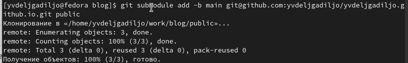

Откроем в mc файл .gitignore и закомментирум public, сохраним
изменения.

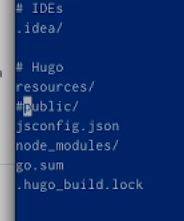

Проверим изменение из предыдущего пункта.

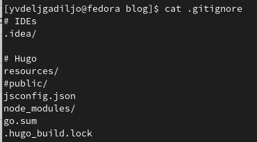

Убедимся в том, что появилась папка "public".

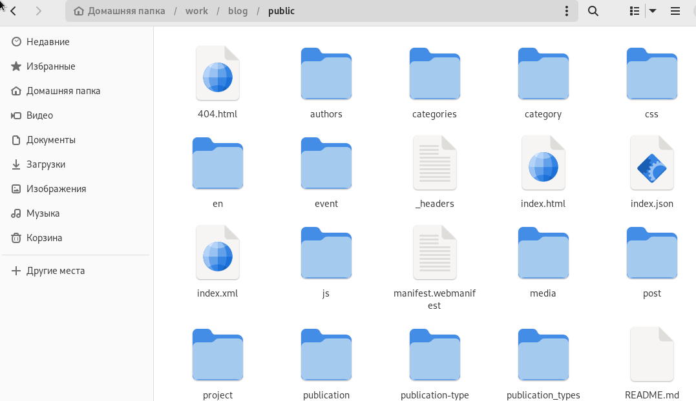

Введем нужную команду, находясь в каталоге "blog", чтобы появились
нужные файлы в папке "public".

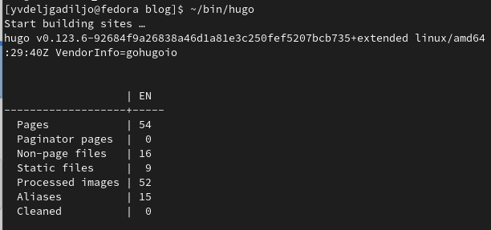

Синхронизируем появившиеся файлы с репозиторием, перейдя в папку
"public".

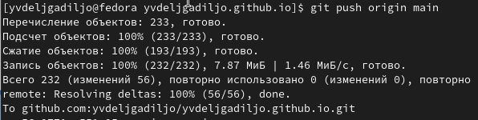

Обновим репозиторий и проверим, что все файлы появились.

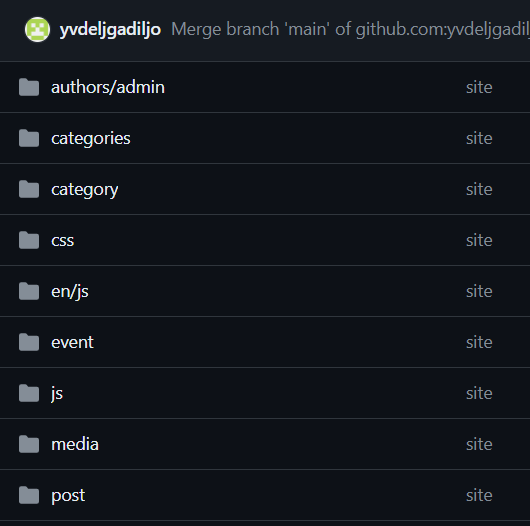

# Выводы

В ходе выполнения данной работы я разместила на Github pages заготовки
для персонального сайта. Первый этап индивидуального проекта завершён.
