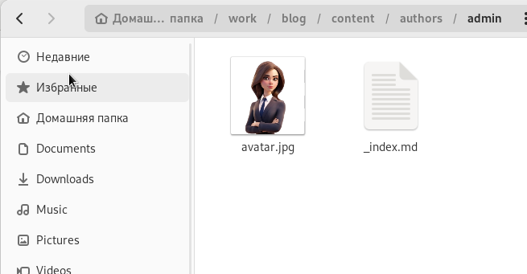
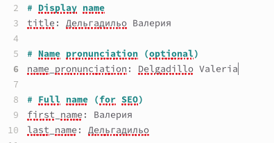
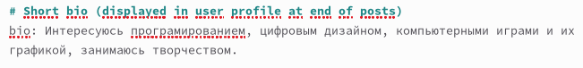
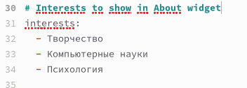
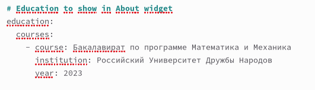
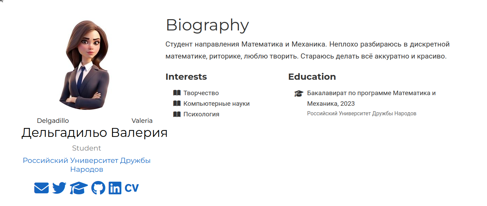
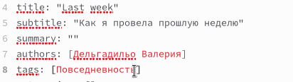
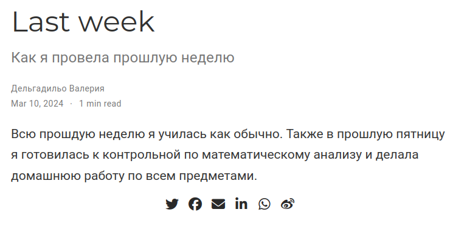
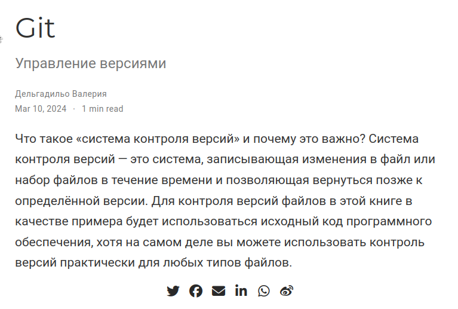

---
## Front matter
title: "Отчёт по второму этапу индивидуального проекта."
subtitle: "Добавить к сайту данные о себе"
author: "Валерия Дельгадильо"

## Generic otions
lang: ru-RU
toc-title: "Содержание"

## Bibliography
bibliography: bib/cite.bib
csl: pandoc/csl/gost-r-7-0-5-2008-numeric.csl

## Pdf output format
toc: true # Table of contents
toc-depth: 2
lof: true # List of figures
lot: true # List of tables
fontsize: 12pt
linestretch: 1.5
papersize: a4
documentclass: scrreprt
## I18n polyglossia
polyglossia-lang:
  name: russian
  options:
	- spelling=modern
	- babelshorthands=true
polyglossia-otherlangs:
  name: english
## I18n babel
babel-lang: russian
babel-otherlangs: english
## Fonts
mainfont: PT Sans
romanfont: PT Sans
sansfont: PT Sans
monofont: PT Sans
mainfontoptions: Ligatures=TeX
romanfontoptions: Ligatures=TeX
sansfontoptions: Ligatures=TeX,Scale=MatchLowercase
monofontoptions: Scale=MatchLowercase,Scale=0.9
## Biblatex
biblatex: true
biblio-style: "gost-numeric"
biblatexoptions:
  - parentracker=true
  - backend=biber
  - hyperref=auto
  - language=auto
  - autolang=other*
  - citestyle=gost-numeric
## Pandoc-crossref LaTeX customization
figureTitle: "Рис."
tableTitle: "Таблица"
listingTitle: "Листинг"
lofTitle: "Список иллюстраций"
lotTitle: "Список таблиц"
lolTitle: "Листинги"
## Misc options
indent: true
header-includes:
  - \usepackage{indentfirst}
  - \usepackage{float} # keep figures where there are in the text
  - \floatplacement{figure}{H} # keep figures where there are in the text
---

# Цель работы

Целью работы является освоение новых команд
терминала, связанных с конструктором статических веб-сайтов Hugo,
приобретение практических навыков изменения информации о владельце сайта
и добавления новых постов, а также более детальное изучение файлов
директории blog персонального проекта.

# Задачи

Добавить к сайту данные о себе. Разместить фотографию владельца сайта.
Разместить краткое описание владельца сайта (Biography). Добавить
информацию об интересах (Interests). Добавить информацию об образовании
(Education). Создать два поста.

# Выполнение работы

Разместили фотографию владельца сайта

Указали имя владельца сайта в файле Markdown, путь которого \~/work/blog/content/authors/admin

Разместили краткое описание владельца сайта

Добавили информацию об интересах

Добавили информацию об образовании

В конце файла записали полную информацию о владельце сайта

С помощью команды \~/bin/hugo server получили ссылку на сайт и
проверили, как на нём отобразилась информация

С помощью команды \~/bin/hugo new post/last_week создали пост о
прошедшей неделе "Понедельник"

Посмотрели, как пост отображается, когда открываешь его по ссылке из
главного сайта.

Создали пост по теме "Управление версиями. Git."

# Выводы

Освоили новые команды терминала, связанные с конструктором статических
веб-сайтов Hugo, приобрели практические навыки изменения информации о
владельце сайта и добавления новых постов, а также лучше познакомились с
файлами в директории blog персонального проекта.
