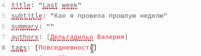

---
## Front matter
lang: ru-RU
title: Отчёт по третью этапу индивидуального проекта.
subtitle: Добавить к сайту данные о себе.
author:
  - Дельгадильо Валерия
institute:
  - Российский университет дружбы народов, Москва, Россия
  - Объединённый институт ядерных исследований, Дубна, Россия
date: 01 января 1970

## i18n babel
babel-lang: russian
babel-otherlangs: english

## Formatting pdf
toc: false
toc-title: Содержание
slide_level: 2
aspectratio: 169
section-titles: true
theme: metropolis
header-includes:
 - \metroset{progressbar=frametitle,sectionpage=progressbar,numbering=fraction}
 - '\makeatletter'
 - '\beamer@ignorenonframefalse'
 - '\makeatother'

---

# Информация

## Докладчик

  * Дельгадильо Валерия
  * Студент 1го курса НММбд-03-23
  * Российский университет дружбы народов
  * [1032229098@pfur.ru](mailto:1032229098@pfur.ru)
  * <https://github.com/yvdeljgadiljo/study_2023-2024_os-intro>

## Цели и задачи
Целью работы является освоение новых команд
терминала, связанных с конструктором статических веб-сайтов Hugo,
приобретение практических навыков изменения информации о владельце сайта
и добавления новых постов, а также более детальное изучение файлов
директории blog персонального проекта.

# Выполнение лабораторной работы

## РСделали skills

{width="6.495833333333334in"
height="1.7527777777777778in"}

## Сделали experience

{width="6.495833333333334in"
height="1.3222222222222222in"}

## С помощью команды \~/bin/hugo new post/last_week2 создали пост о прошедшей неделе.

{width="3.433630796150481in"
height="0.9667508748906387in"}

## Посмотрели, как пост отображается, когда открываешь его по ссылке из главного сайта.

{width="6.495833333333334in"
height="3.4159722222222224in"}

## Создали пост по теме "Языки разметки. LaTeX."

{width="6.495833333333334in"
height="3.467361111111111in"}

# Выводы
## Выводы
Освоили новые команды терминала, связанные с конструктором статических
веб-сайтов Hugo, приобрели практические навыки изменения информации о
владельце сайта и добавления новых постов, а также лучше познакомились с
файлами в директории blog персонального проекта.
