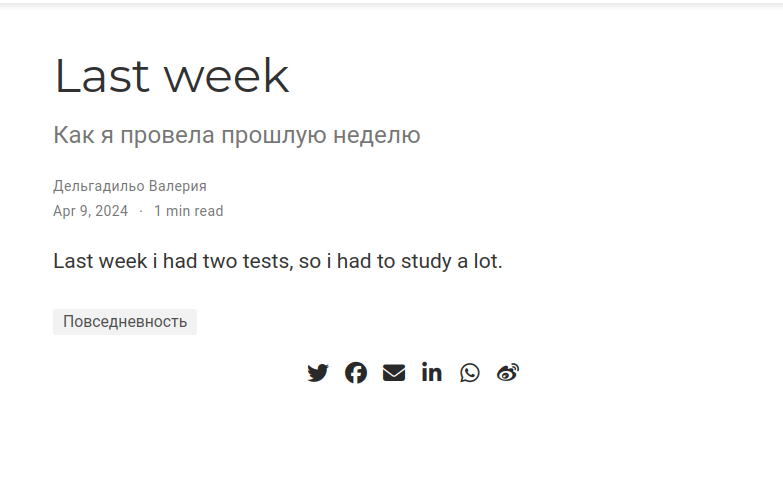

---
## Front matter
lang: ru-RU
title: Отчёт по 5ую этапу индивидуального проекта.
subtitle: Добавить к сайту данные о себе.
author:
  - Дельгадильо Валерия
institute:
  - Российский университет дружбы народов, Москва, Россия
  - Объединённый институт ядерных исследований, Дубна, Россия
date: 01 января 1970

## i18n babel
babel-lang: russian
babel-otherlangs: english

## Formatting pdf
toc: false
toc-title: Содержание
slide_level: 2
aspectratio: 169
section-titles: true
theme: metropolis
header-includes:
 - \metroset{progressbar=frametitle,sectionpage=progressbar,numbering=fraction}
 - '\makeatletter'
 - '\beamer@ignorenonframefalse'
 - '\makeatother'

---

# Информация

## Докладчик

  * Дельгадильо Валерия
  * Студент 1го курса НММбд-03-23
  * Российский университет дружбы народов
  * [1032229098@pfur.ru](mailto:1032229098@pfur.ru)
  * <https://github.com/yvdeljgadiljo/study_2023-2024_os-intro>

## Цели и задачи
Целью работы является освоение новых команд
терминала, связанных с конструктором статических веб-сайтов Hugo,
приобретение практических навыков изменения информации о владельце сайта
и добавления новых постов, а также более детальное изучение файлов
директории blog персонального проекта.

# Выполнение лабораторной работы

## Я написала пост о прошлой неделе.
{width="5.017101924759405in"
height="3.141938976377953in"}

## Я добавилa сообщение в тему: Написание отчетов.

{width="6.495833333333334in"
height="4.8277777777777775in"}

## Я сделала записи для персональных проектов

{width="3.100269028871391in"
height="0.5500481189851268in"}

# Выводы
## Выводы
Освоили новые команды терминала, связанные с конструктором статических
веб-сайтов Hugo, приобрели практические навыки изменения информации о
владельце сайта и добавления новых постов, а также лучше познакомились с
файлами в директории blog персонального проекта.
