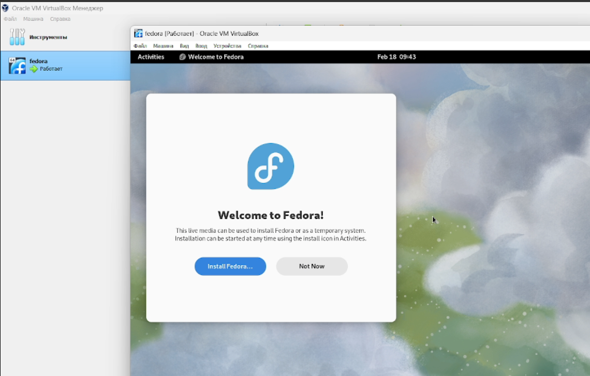
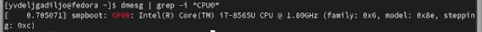

---
## Front matter
title: "Шаблон отчёта по лабораторной работе 1"
subtitle: "Установка и конфигурация операционной системы на виртуальную машину"
author: "Валерия Дельгадильо"

## Generic otions
lang: ru-RU
toc-title: "Содержание"

## Bibliography
bibliography: bib/cite.bib
csl: pandoc/csl/gost-r-7-0-5-2008-numeric.csl

## Pdf output format
toc: true # Table of contents
toc-depth: 2
lof: true # List of figures
lot: true # List of tables
fontsize: 12pt
linestretch: 1.5
papersize: a4
documentclass: scrreprt
## I18n polyglossia
polyglossia-lang:
  name: russian
  options:
	- spelling=modern
	- babelshorthands=true
polyglossia-otherlangs:
  name: english
## I18n babel
babel-lang: russian
babel-otherlangs: english
## Fonts
mainfont: PT Serif
romanfont: PT Serif
sansfont: PT Sans
monofont: PT Mono
mainfontoptions: Ligatures=TeX
romanfontoptions: Ligatures=TeX
sansfontoptions: Ligatures=TeX,Scale=MatchLowercase
monofontoptions: Scale=MatchLowercase,Scale=0.9
## Biblatex
biblatex: true
biblio-style: "gost-numeric"
biblatexoptions:
  - parentracker=true
  - backend=biber
  - hyperref=auto
  - language=auto
  - autolang=other*
  - citestyle=gost-numeric
## Pandoc-crossref LaTeX customization
figureTitle: "Рис."
tableTitle: "Таблица"
listingTitle: "Листинг"
lofTitle: "Список иллюстраций"
lotTitle: "Список таблиц"
lolTitle: "Листинги"
## Misc options
indent: true
header-includes:
  - \usepackage{indentfirst}
  - \usepackage{float} # keep figures where there are in the text
  - \floatplacement{figure}{H} # keep figures where there are in the text
---

# Цель работы 

Целью данной работы является приобретение практических навыков установки операционной системы на виртуальную машину, настройки минимально необходимых для дальнейшей работы сервисов.Задание

Необходимо установить операционную систему Linux на виртуальную машину,
запустить минимально необходимые для дальнейшей работы сервисы и
программы. 1. Запустить виртуальную машину, добавить ОС Linux 2.
Установить объем оперативной памяти 3. Создать виртуальный жесткий диск
и установить его объем 4. Установить Linux, выбрать язык и носитель 5.
Создать логин и пароль 6. Установить программы через терминал 7.
Выполнить домашнюю работу и ответить на вопросы
  

# Лабораторной работы 

Выполнение работы:

Произведём скачивание и установку виртуальной машины через сайт (Рис.1):

<https://www.virtualbox.org/>

[]{#_Toc151654470 .anchor}Следующим шагом нужно скачать дистрибутив
Linux Fedora, воспользовавшись сайтом (Рис. 2):

<https://fedoraproject.org/workstation/download>

Я установила операционную систему и произвела первичные настройки.

# Задание для самостоятельной работы

1\) Версия ядра Linux (Linux version).

Версию ядра можно посмотреть командой dmesg \| grep "linux version".

2\) Частота процессора (Detected Mhz processor).

Частоту процессора можно посмотреть командой dmesg \| grep -I "MHz".

3\) Модель процессора (CPU0).

Модель процессора можно посмотреть командой dmesg \| grep "CPU0".

4\) Объем доступной оперативной памяти (Memory available).

Объём доступной памяти можно посмотреть командой free -m.

5\) Тип обнаруженного гипервизора (Hypervisor detected).

Тип обнаруженного гипервизора можно посмотреть командой dmesg \| grep -

I "hypervisor detected".

6\) Тип файловой системы корневого раздела.

Тип файловой системы корневого раздела можно посмотреть командой dmesg
\| grep -I "filesystem".

7\) Последовательность монтирования файловых систем.

Последовательность монтирования файловых систем можно посмотреть
командой dmesg \| grep -i "mount".

# Ответы на контрольные вопросы

1\) Содержит информацию об идентификаторе учетной записи пользователя и
ее имени, идентификаторе основной группы пользователя и ее названии

2\)

-   для получения справки по команде -- info \"название команды\" или

-   \"название команды\" \--help

-   для перемещения по файловой системе -- cd \"путь\"

-   для просмотра содержимого каталога -- dir либо ls

-   для определения объема каталога -- du -sh \"путь\"

-   для создания каталога - mkdir \"название\" для удаления -- rmdir
    \"название\"

-   для создания файла touch \"название\" или cat \> \"название\" для
    удаления

-   rm \"название\"

-   для создания каталога с правами mkdir --mode=\"идентификатор\"

-   \"название каталога\" для правки прав доступа для файла chmod

-   для просмотра истории команд -- history

3\) Файловая система определяет способ хранения, организации
данных/информации на определенных носителях.

4\) dmesg \| grep "filesystem"

5\) pkill «название процесса»

#  Выводы

В ходе выполнения лабораторной работы были приобретены практические
навыки установки операционной системы на виртуальную машину и настройки
минимально необходимых для дальнейшей работы сервисов.

# Список литературы

-   GDB: The GNU Project Debugger. --- URL:
    https://www.gnu.org/software/gdb/.

-   GNU Bash Manual. --- 2016. --- URL:
    https://www.gnu.org/software/bash/manual/.

-   Midnight Commander Development Center. --- 2021. --- URL:
    https://midnight-commander.org/.

-   NASM Assembly Language Tutorials. --- 2021. --- URL:
    https://asmtutor.com/.

-   Newham C. Learning the bash Shell: Unix Shell Programming. ---
    O'Reilly Media, 2005. ---354 с. --- (In a Nutshell). ---
    ISBN 0596009658. --- URL:
    http://www.amazon.com/Learningbash-Shell-Programming-Nutshell/dp/0596009658.

-   Robbins A. Bash Pocket Reference. --- O'Reilly Media, 2016. --- 156
    с. --- ISBN 978-1491941591.

-   The NASM documentation. --- 2021. --- URL:
    https://www.nasm.us/docs.php.

-   Zarrelli G. Mastering Bash. --- Packt Publishing, 2017. --- 502 с.
    --- ISBN 9781784396879.

-   Колдаев В. Д., Лупин С. А. Архитектура ЭВМ. --- М. : Форум, 2018.

-   Куляс О. Л., Никитин К. А. Курс программирования на ASSEMBLER. ---
    М. : Солон-Пресс, 2017.

-   Новожилов О. П. Архитектура ЭВМ и систем. --- М. : Юрайт, 2016.

-   Расширенный ассемблер: NASM. --- 2021. --- URL:
    https://www.opennet.ru/docs/RUS/nasm/.

-   Робачевский А., Немнюгин С., Стесик О. Операционная система UNIX.
    --- 2-е изд. --- БХВПетербург, 2010. --- 656 с. --- ISBN
    978-5-94157-538-1.

-   Столяров А. Программирование на языке ассемблера NASM для ОС Unix.
    --- 2-е изд. --- М. : МАКС Пресс, 2011. --- URL:
    http://www.stolyarov.info/books/asm_unix.

-   Таненбаум Э. Архитектура компьютера. --- 6-е изд. --- СПб. :
    Питер, 2013. --- 874 с. --- (Классика Computer Science).

-   Таненбаум Э., Бос Х. Современные операционн
