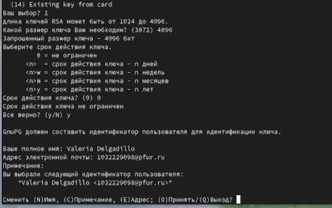
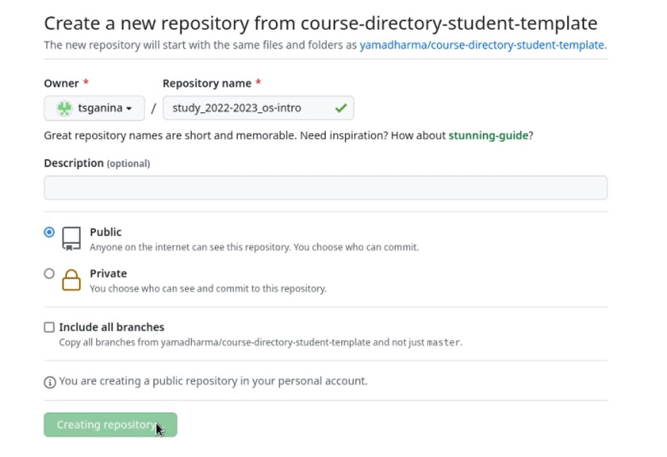
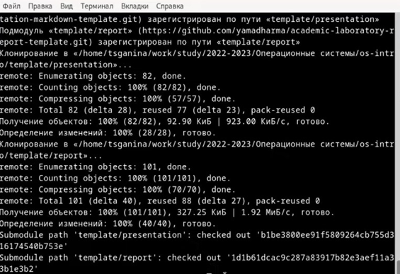

---
## Front matter
title: "Шаблон отчёта по лабораторной работе 2"
subtitle: "Markdown"
author: "Валерия Дельгадильо"

## Generic otions
lang: ru-RU
toc-title: "Содержание"

## Bibliography
bibliography: bib/cite.bib
csl: pandoc/csl/gost-r-7-0-5-2008-numeric.csl

## Pdf output format
toc: true # Table of contents
toc-depth: 2
lof: true # List of figures
lot: true # List of tables
fontsize: 12pt
linestretch: 1.5
papersize: a4
documentclass: scrreprt
## I18n polyglossia
polyglossia-lang:
  name: russian
  options:
	- spelling=modern
	- babelshorthands=true
polyglossia-otherlangs:
  name: english
## I18n babel
babel-lang: russian
babel-otherlangs: english
## Fonts
mainfont: PT Serif
romanfont: PT Serif
sansfont: PT Sans
monofont: PT Mono
mainfontoptions: Ligatures=TeX
romanfontoptions: Ligatures=TeX
sansfontoptions: Ligatures=TeX,Scale=MatchLowercase
monofontoptions: Scale=MatchLowercase,Scale=0.9
## Biblatex
biblatex: true
biblio-style: "gost-numeric"
biblatexoptions:
  - parentracker=true
  - backend=biber
  - hyperref=auto
  - language=auto
  - autolang=other*
  - citestyle=gost-numeric
## Pandoc-crossref LaTeX customization
figureTitle: "Рис."
tableTitle: "Таблица"
listingTitle: "Листинг"
lofTitle: "Список иллюстраций"
lotTitle: "Список таблиц"
lolTitle: "Листинги"
## Misc options
indent: true
header-includes:
  - \usepackage{indentfirst}
  - \usepackage{float} # keep figures where there are in the text
  - \floatplacement{figure}{H} # keep figures where there are in the text
---

# Цель работы 

• Изучить идеологию и применение средств контроля версий.

• Освоить умения по работе с git. 

# 2 Выполнение лабораторной работы

Всю практическую часть я выполнял в первом семестре и детально изложил в
файле report_old.pdf. Здесь посмотрим только на основыне вехи: 1.
установка пакета git на компьютер 2. Создание аакауната на github.com 3.
Создание и подключение ssh-ключа 4. создание и развертка репозитория из
шаблона.

# Лабораторной работы 

1.  Базовая настройка git (рис. 4.1).

2.  Создание SSH ключа (рис. 4.2, 4.3).

3. Создание PGP ключа (рис. 4.4, 4.5, 4.6, 4.7, 4.8, 4.9).

 

4. Добавление PGP ключа в GitHub (рис. 4.10, 4.11, 4.12).

 

5. Настройка автоматических подписей коммитов git (рис. 4.13).

6. Настройка gh (рис. 4.14, 4.15, 4.16).

7. Шаблон для рабочего пространства (рис. 4.17, 4.18).

8. Создание локального репозитория курса на основе шаблона (рис.4.19, 4.20, 4.21).

 

 

9. Настройка каталога курса (рис. 4.22, 4.23, 4.24, 4.25).

# Контрольные вопросы.

1.  Что такое системы контроля версий (VCS) и для решения каких задач
     они предназначаются?

 Система контроля версий - программное обеспечение для облегчения
 работы с изменяющейся информацией.

 Системы контроля версий (Version Control System,VCS) применяются при
 работе нескольких человек над одним проектом. Обычно основное дерево
 проекта хранится в локальном или удалённом репозитории, к которому
 настроен доступ для участников проекта.При внесении изменений в
 содержание проекта система контроля версий позволяет их фиксировать,
 совмещать изменения, произведённые разными участниками проекта,
 производить откат к любой более ранней версии проекта, если это
 требуется.

 2. Объясните следующие понятия VCS и их отношения: хранилище, commit,
 история, рабочая копия.

-   Хранилище - репозиторий, хранилище версий, в нем хранятся все
     документы вместе с их историей, и другой служебной информацией.

-   Commit - отслеживание изменений, сохранение разницы в рабочих
     изменениях.

-   История - сохранение всех изменений в проекте и при необходимости
     возможность обратиться к старым данным.

-   Рабочая копия - копия проекта, связанная с репозиторием,текущее
     состояние файлов проекта, основанное на их последней версии из
     хранилища.

 3. Что представляют собой и чем отличаются централизованные и
 децентрализованные VCS? Приведите примеры VCS каждого вида.

-   Централизованные VCS - одно основное хранилище всего проекта, каждый
     пользователь копирует себе необходимые файлы из репозитория и
     изменяет их, а потом может добавить обратно. Примеры: -
     Subversion; - CVS; - TFS; -VAULT; -AccuRev;

-   Децентрализованные VCS -У каждого пользователя свой вариант
     репозитория,есть возможностьдобавлять и забирать версии из любого
     репозитория.

 Например: - Git; - Mercurial; - Bazaar;

 Обычно используются централизованные системы контроля версий, с одним
 общим репозиторием.

4.  Опишите действия с VCS при единоличной работе с хранилищем. Сначала
    нужно создать удалённый репозиторий, после - подключить его. Затем
    по мере того, как проект будет выполняться, нужно отправлять данные
    на сервер.

5.  Опишите порядок работы с общим хранилищем VCS. В начале при помощи
    последовательности команд пользователь получает нужную ему версию
    данных. Потом он работает с ними, вносит некоторые изменения, и уже
    после этого он может разместить новую версию в хранилище. При этом
    предыдущие версии не удаляются из хранилища, что является очень
    удобным - к ним можно вернуться в любой момент.

6.  Каковы основные задачи, решаемые инструментальным средством git?

-   Хранить информацию обо всех изменениях, производимых в проекте.

-   Обеспечить командную работу.

 7. Назовите и дайте краткую характеристику командам git.

 git init - Создание основного дерева репозитория git pull - Получение
 обновлений (изменений) текущего дерева из центрального репозитория

 git push - Отправка всех произведённых изменений локального дерева в
 центральный репозиторий

 git status - Просмотр списка изменённых файлов в текущей директории
 изменений

 git add . / git add \<имя файла\ / git rm \<имя файла\ - Сохранение
 текущих изменений git commit / git commit -am \"описание коммита\" --
 Сохранение добавленных изменений

 git checkout -b имя_ветки - Создание новой ветки, базирующейся на
 текущей

 git checkout имя_ветки - Переключение на некоторую ветку git push
 origin имя_ветки - Отправка изменений конкретной ветки в центральный
 репозиторий

 git merge \--no-ff имя_ветки - Слияние ветки с текущим деревом git
 branch -d имя_ветки -Удаление локальной уже слитой с основным деревом
 ветки git branch -D имя_ветки - Принудительное удаление локальной
 ветки git push origin :имя_ветки -Удаление ветки с центрального
 репозитория.

8.  Приведите примеры использования при работе с локальным и удалённым
    репозиториями. git push -all (push origin master/любой branch)

9.  Что такое и зачем могут быть нужны ветви (branches)? Ветвь - один из
    параллельных участков истории проекта в одном хранилище. Все ветви
    исходятиз одной версии-точки ветвления.Обычно ветвиделятся на master
    и trunk. Между ветками возможно и слияние. Ветки нужны для
    разработки новых функций.

Как и зачем можно игнорировать некоторые файлы при commit? Игнорировать
некоторые файлы можно прописав шаблон .gitignore специально для
игнорируемых файлов. Зачем это нужно? Чтобы в репозиторий не попали
"лишние" файлы, которые неминуемо будут возникать при работе над
проектом. Это могут быть временные файлы, объектные файлы.

#  Выводы

• Я изучила идеологию и применение средств контроля версий.

• Освоила умения по работе с git.

# Список литературы

-   GDB: The GNU Project Debugger. --- URL:
    https://www.gnu.org/software/gdb/.

-   GNU Bash Manual. --- 2016. --- URL:
    https://www.gnu.org/software/bash/manual/.

-   Midnight Commander Development Center. --- 2021. --- URL:
    https://midnight-commander.org/.

-   NASM Assembly Language Tutorials. --- 2021. --- URL:
    https://asmtutor.com/.

-   Newham C. Learning the bash Shell: Unix Shell Programming. ---
    O'Reilly Media, 2005. ---354 с. --- (In a Nutshell). ---
    ISBN 0596009658. --- URL:
    http://www.amazon.com/Learningbash-Shell-Programming-Nutshell/dp/0596009658.

-   Robbins A. Bash Pocket Reference. --- O'Reilly Media, 2016. --- 156
    с. --- ISBN 978-1491941591.

-   The NASM documentation. --- 2021. --- URL:
    https://www.nasm.us/docs.php.

-   Zarrelli G. Mastering Bash. --- Packt Publishing, 2017. --- 502 с.
    --- ISBN 9781784396879.

-   Колдаев В. Д., Лупин С. А. Архитектура ЭВМ. --- М. : Форум, 2018.

-   Куляс О. Л., Никитин К. А. Курс программирования на ASSEMBLER. ---
    М. : Солон-Пресс, 2017.

-   Новожилов О. П. Архитектура ЭВМ и систем. --- М. : Юрайт, 2016.

-   Расширенный ассемблер: NASM. --- 2021. --- URL:
    https://www.opennet.ru/docs/RUS/nasm/.

-   Робачевский А., Немнюгин С., Стесик О. Операционная система UNIX.
    --- 2-е изд. --- БХВПетербург, 2010. --- 656 с. --- ISBN
    978-5-94157-538-1.

-   Столяров А. Программирование на языке ассемблера NASM для ОС Unix.
    --- 2-е изд. --- М. : МАКС Пресс, 2011. --- URL:
    http://www.stolyarov.info/books/asm_unix.

-   Таненбаум Э. Архитектура компьютера. --- 6-е изд. --- СПб. :
    Питер, 2013. --- 874 с. --- (Классика Computer Science).

-   Таненбаум Э., Бос Х. Современные операционн
