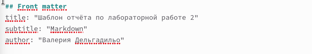
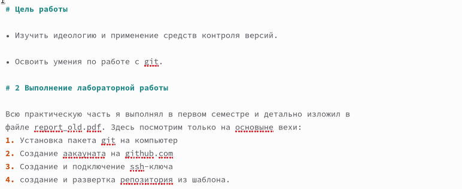
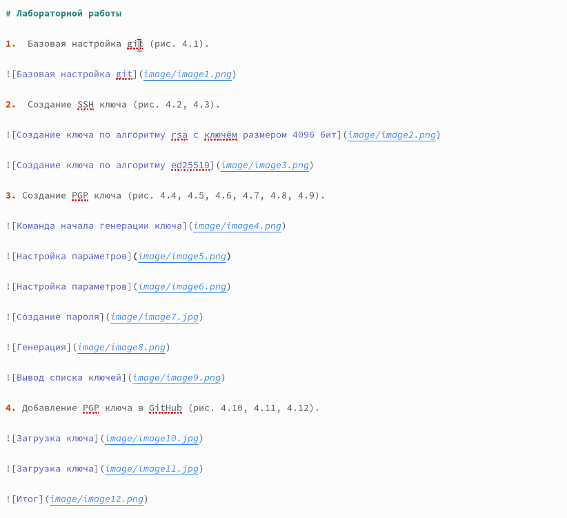
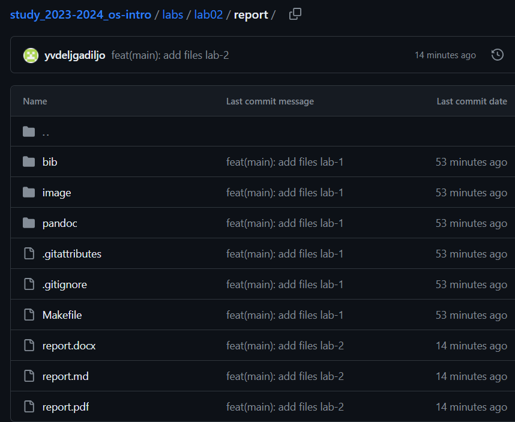

---
## Front matter
lang: ru-RU
title: Лабораторая работа 3
subtitle: Работа с Markdown
author:
  - Дельгадильо Валерия
institute:
  - Российский университет дружбы народов, Москва, Россия
  - Объединённый институт ядерных исследований, Дубна, Россия
date: 01 января 1970

## i18n babel
babel-lang: russian
babel-otherlangs: english

## Formatting pdf
toc: false
toc-title: Содержание
slide_level: 2
aspectratio: 169
section-titles: true
theme: metropolis
header-includes:
 - \metroset{progressbar=frametitle,sectionpage=progressbar,numbering=fraction}
 - '\makeatletter'
 - '\beamer@ignorenonframefalse'
 - '\makeatother'

---

# Информация

## Докладчик

  * Дельгадильо Валерия
  * Студент 1го курса НММбд-03-23
  * Российский университет дружбы народов
  * [1032229098@pfur.ru](mailto:1032229098@pfur.ru)
  * <https://github.com/yvdeljgadiljo/study_2023-2024_os-intro>

## Цели и задачи

- Научиться работать в Markdown и сделать в этом формате отчет.

# Выполнение лабораторной работы

## Указываем название лабораторной работы и автора 

## Пишем цель работы и задание (каждый заголовок обозначаем решеткой):

## Поэтапно описываем выпольнение лабораторной работы, прикрепляя скриншоты с подписью:

## Пишем вывод, согласно цели работи: 

# Выводы

Я приобрела навыки создания отчетов в формате Markdown.

## Результаты

Приобретены навыки работы с Markdown, создан отчет в этом формате.

## Итог

работа с MArkdown - это несложно и понятно.

