---
## Front matter
lang: ru-RU
title: Лабораторная работа 4
subtitle: 
author:
  - Дельгадильо В.
institute:
  - Российский университет дружбы народов, Москва, Россия
  - Объединённый институт ядерных исследований, Дубна, Россия
date: 01 января 1970

## i18n babel
babel-lang: russian
babel-otherlangs: english

## Formatting pdf
toc: false
toc-title: Содержание
slide_level: 2
aspectratio: 169
section-titles: true
theme: metropolis
header-includes:
 - \metroset{progressbar=frametitle,sectionpage=progressbar,numbering=fraction}
 - '\makeatletter'
 - '\beamer@ignorenonframefalse'
 - '\makeatother'
---

# Информация

## Докладчик

:::::::::::::: {.columns align=center}
::: {.column width="70%"}

  * Дельгадильо Валерия
  * Студент 1го курса НММбд-03-23
  * Российский университет дружбы народов
  * [1032229098@pfur.ru](mailto:1032229098@pfur.ru)
  * <https://github.com/yvdeljgadiljo/study_2023-2024_os-intro>

:::
::: {.column width="30%"}

:::
::::::::::::::

## Цели и задачи

- Получение навыков правильной работы с репозиториями git.

# Выполнение лабораторной работы
## 

### Установка git-flow из коллекции репoзитoриев Copr (https://copr.fedorainfracloud.org/coprs/elegos/gitflow/): 
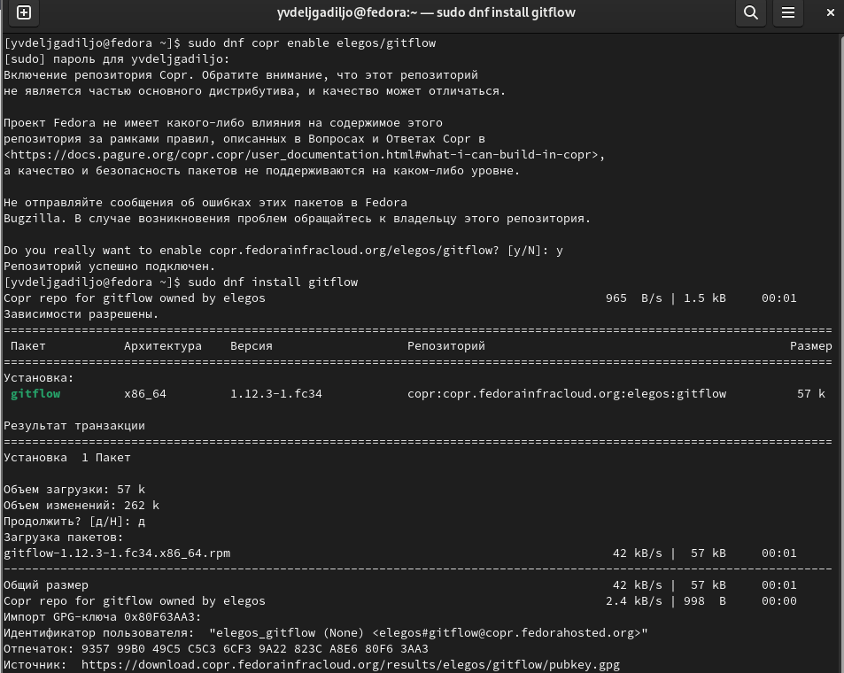

### Установка Node.js. На Node.js базируется программное обеспечение для семантического версионирования и общепринятых коммитов.
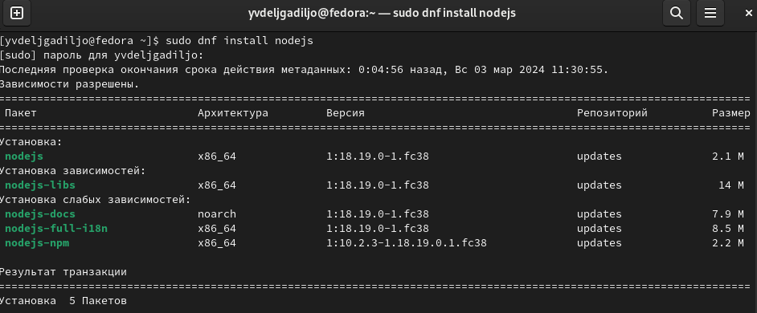

### Для работы с Node.js добавим каталог с исполняемыми файлами, устанавливаемыми yarn, в переменную PATH.
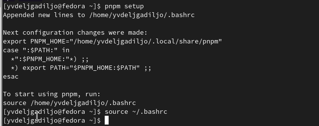

## Общепринятые коммиты

### Данная программа используется для помощи в форматировании коммитов.
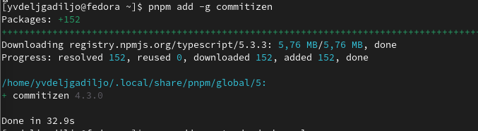

### Данная программа используется для помощи в создании логов.
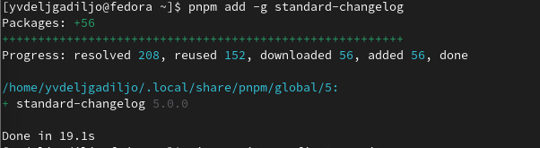

### Cоздание репозитория git
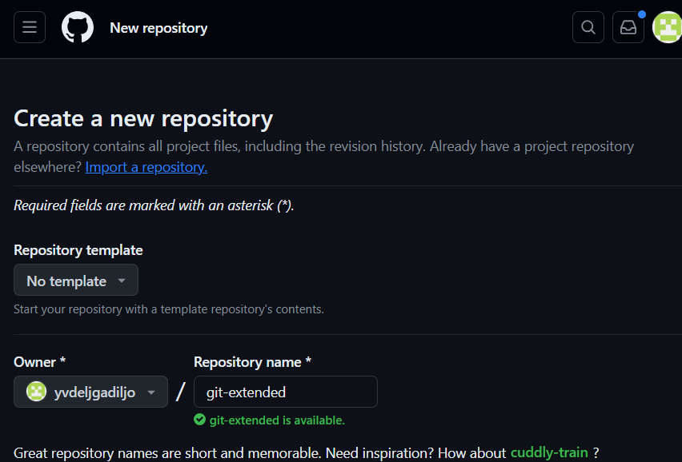

### Делаем первый коммит и выкладываем на github:
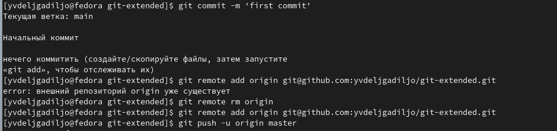

### Сконфигурим формат коммитов. Для этого добавим в файл package.json команду для формирования коммитов:
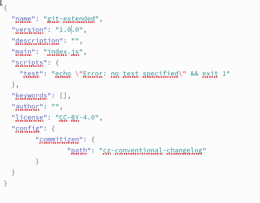

### Добавим новые файлы, выполним коммит и oтправим на github
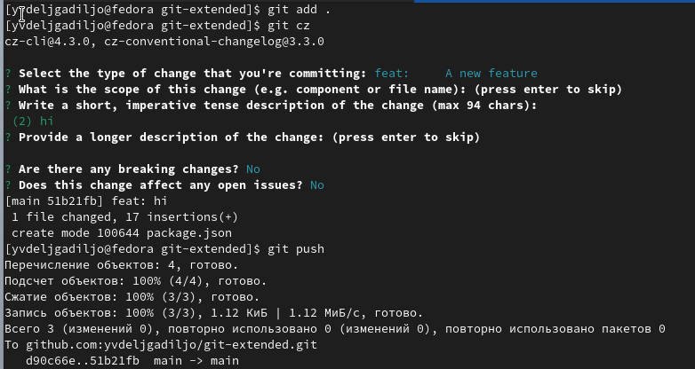

### Инициализируем git-flow, проверьте, что Вы на ветке develop и загрузите весь репозиторий в хранилище.
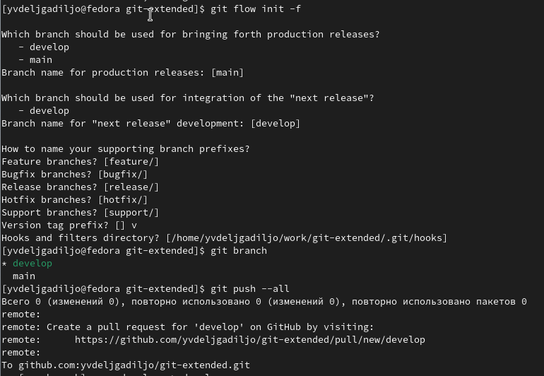

### Установите внешнюю ветку как вышестоящую для этой ветки, создадим релиз с версией 1.0.0, создадим журнал изменений и добавим журнал изменений в индекс.
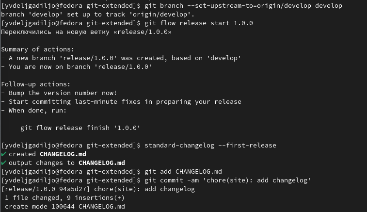

### Зальём релизную ветку в основную ветку, отправим данные на github и создадим релиз на github. Для этого будем использовать утилиты работы с github:
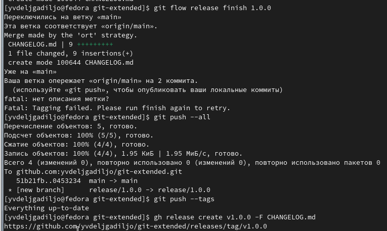

### Создадим ветку для новой функциональности и по окончании разработки новой функциональности следующим шагом следует объединить ветку feature_branch c develop.
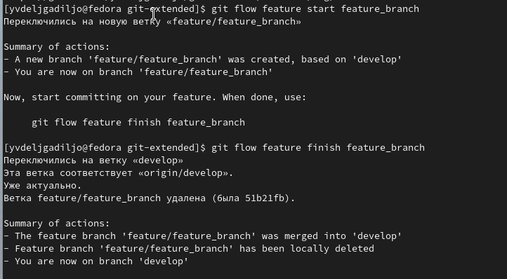

### Создадим релиз с версией 1.2.3, обновите номер версии в файле package.json. Установите её в 1.2.3. Создадим журнал изменений и добавим журнал изменений в индекс и зальём релизную ветку в основную ветку.
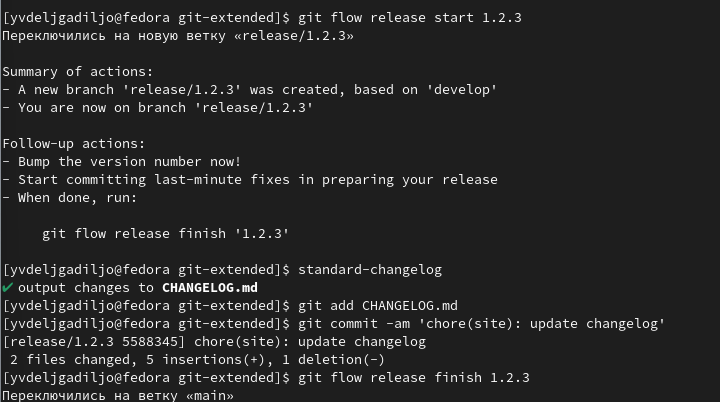

### Отправим данные на github и создадим релиз на github с комментарием из журнала изменений:
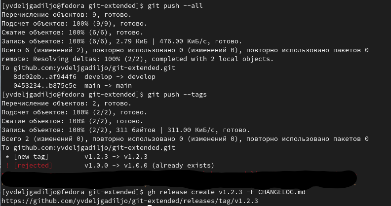

# Выводы
-   Освоила умения по работе с git.

-   Приобрелa навыки правильной работы с git-репозиториям.
