---
## Front matter
title: "Oтчёта по лабораторной работе 6"
subtitle: "Основы интерфейса взаимодействия пользователя с системой Unix на уровне командой строки"
author: " Дельгадильо Валерия"

## Generic otions
lang: ru-RU
toc-title: "Содержание"

## Bibliography
bibliography: bib/cite.bib
csl: pandoc/csl/gost-r-7-0-5-2008-numeric.csl

## Pdf output format
toc: true # Table of contents
toc-depth: 2
lof: true # List of figures
lot: true # List of tables
fontsize: 12pt
linestretch: 1.5
papersize: a4
documentclass: scrreprt
## I18n polyglossia
polyglossia-lang:
  name: russian
  options:
	- spelling=modern
	- babelshorthands=true
polyglossia-otherlangs:
  name: english
## I18n babel
babel-lang: russian
babel-otherlangs: english
## Fonts
mainfont: PT Sans
romanfont: PT Sans
sansfont: PT Sans
monofont: PT Sans
mainfontoptions: Ligatures=TeX
romanfontoptions: Ligatures=TeX
sansfontoptions: Ligatures=TeX,Scale=MatchLowercase
monofontoptions: Scale=MatchLowercase,Scale=0.9
## Biblatex
biblatex: true
biblio-style: "gost-numeric"
biblatexoptions:
  - parentracker=true
  - backend=biber
  - hyperref=auto
  - language=auto
  - autolang=other*
  - citestyle=gost-numeric
## Pandoc-crossref LaTeX customization
figureTitle: "Рис."
tableTitle: "Таблица"
listingTitle: "Листинг"
lofTitle: "Список иллюстраций"
lotTitle: "Список таблиц"
lolTitle: "Листинги"
## Misc options
indent: true
header-includes:
  - \usepackage{indentfirst}
  - \usepackage{float} # keep figures where there are in the text
  - \floatplacement{figure}{H} # keep figures where there are in the text
---

# Цель работы 

> Приобрести практические навыки взаимодействия с системой посредством командной строки

# Лабораторной работы 

1.  Определим полное имя домашнего каталога.

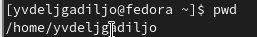

2.  Перейдите в каталог /tmp и выведем на экран содержимое каталога с
    помощью команды ls.

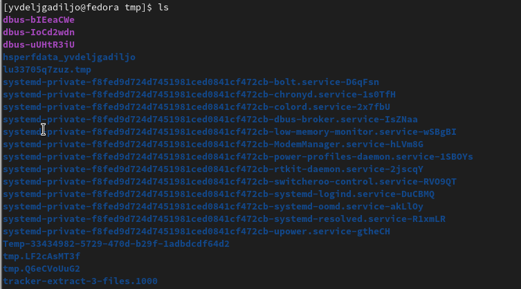

Применим команду ls с опцией -a, с ее помощью выведем скрытые каталоги.

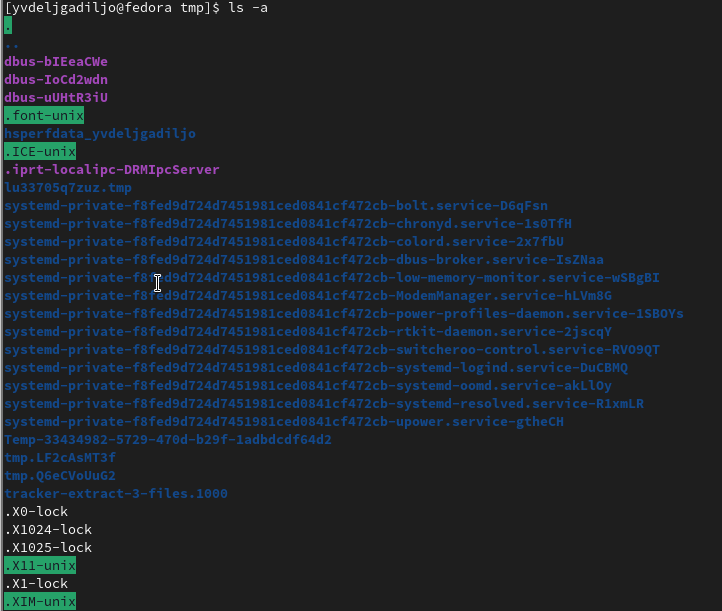

Применим команду ls с опцией -l, с ее помощью вывели подробную
информацию о файлах и каталогах.

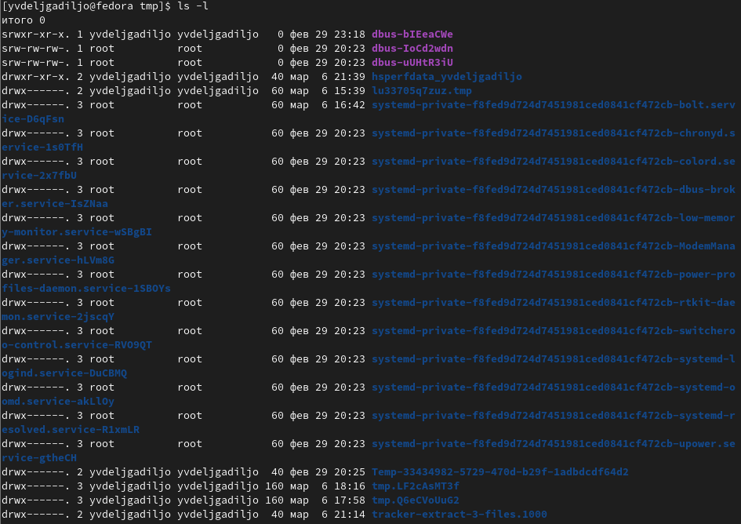

3.  Определим, есть ли в каталоге /var/spool подкаталог с именем cron?
    Он там нет.

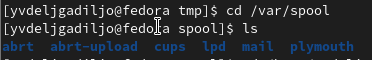

4.  Перейдем в Ваш домашний каталог и выведем на экран его содержимое.
    Определим, кто является владельцем файлов и подкаталогов?

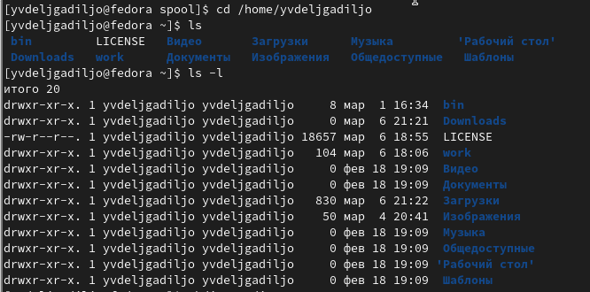

5.  В домашнем каталоге создадим новый каталог с именем newdir.

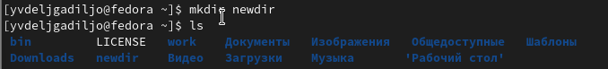

6.  В каталоге \~/newdir создадим новый каталог с именем morefun.

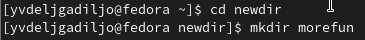

7.  В домашнем каталоге создадим одной командой три новых каталога с
    именами letters, memos, misk. Затем удалим эти каталоги одной
    командой.

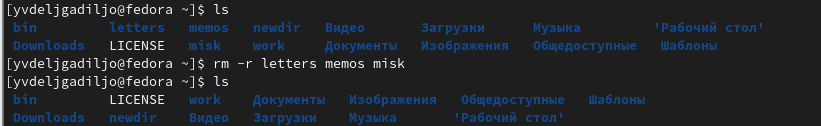

8.  Попробуем удалить ранее созданный каталог \~/newdir командой rm.
    Проверим, был ли каталог удалён. Без -r мы бы не смогли удалить не
    пустые каталоги.

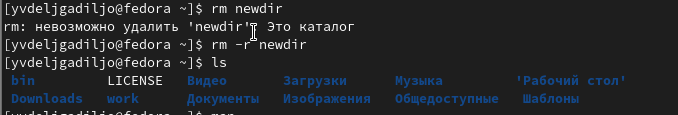

10. С помощью команды man определим, какую опцию команды ls нужно
    использовать для просмотра содержимого не только указанного
    каталога, но и подкаталогов, входящих в него.

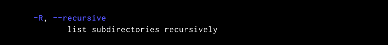

11. С помощью команды man определим набор опций команды ls, позволяющий
    отсортировать по времени последнего изменения выводимый список
    содержимого каталога с развёрнутым описанием файлов.

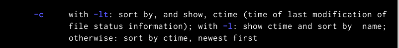

12. Далее c помощью команды man выведем несколько команд. cd-отвечает за
    переходы между каталогами pwd-вывод нахождения на данный момент
    mkdir-создание каталогов rmdir-удаление пустых каталогов rm-удаление
    файлов и директорий

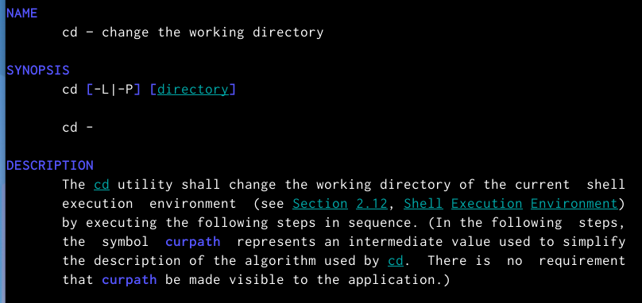

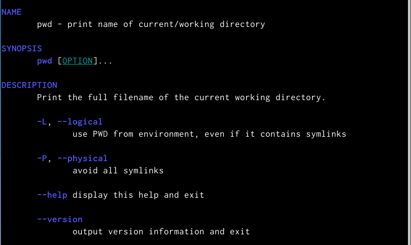

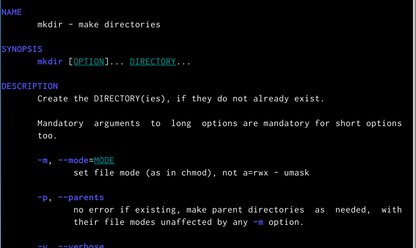

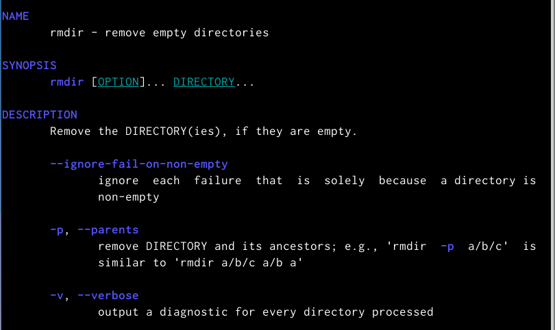

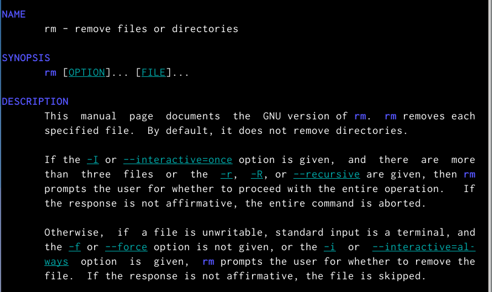

13. Используя информацию, полученную при помощи команды history,
    выполним модификацию и исполнение нескольких команд из буфера
    команд.

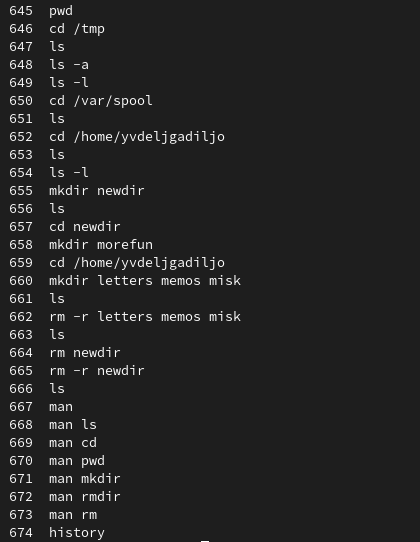

# Контрольные вопросы

1.  Что такое командная строка? Термина для работы с файлами,
    каталогами.
2.  При помощи какой команды можно определить абсолютный путь текущего
    каталога? pwd
3.  При помощи какой команды и каких опций можно определить только тип
    файлов и их имена в текущем каталоге? Приведите примеры. ls -l
4.  Каким образом отобразить информацию о скрытых файлах? Приведите
    примеры. ls -a
5.  При помощи каких команд можно удалить файл и каталог? Можно ли это
    сделать одной и той же командой? Приведите примеры. rm/rmdir рм не
    удалит не пустой каталог.
6.  Каким образом можно вывести информацию о последних выполненных
    пользователем командах? работы? history
7.  Как воспользоваться историей команд для их модифицированного
    выполнения? Приведите примеры. !:s/чтоменяем/начтоменяем
8.  Приведите примеры запуска нескольких команд в одной строке.
9.  Дайте определение и приведите примера символов экранирования.
    символы замены стандартных слов \~=home
10. Охарактеризуйте вывод информации на экран после выполнения команды
    ls с опцией

> Вывод расширенной информации о файле-вес, название, защита.

11. Что такое относительный путь к файлу? Приведите примеры
    использования относительного и абсолютного пути при выполнении
    какой-либо команды.
12. Как получить информацию об интересующей вас команде? man
13. Какая клавиша или комбинация клавиш служит для автоматического
    дополнения вводимых команд? Ctrl+R 
    
# Выводы

В данной лабораторной работе мы познакомились с командной строкой,
научились простейшим командам.

# Список литературы

-   GDB: The GNU Project Debugger. --- URL:
    https://www.gnu.org/software/gdb/.

-   GNU Bash Manual. --- 2016. --- URL:
    https://www.gnu.org/software/bash/manual/.

-   Midnight Commander Development Center. --- 2021. --- URL:
    https://midnight-commander.org/.

-   NASM Assembly Language Tutorials. --- 2021. --- URL:
    https://asmtutor.com/.

-   Newham C. Learning the bash Shell: Unix Shell Programming. ---
    O'Reilly Media, 2005. ---354 с. --- (In a Nutshell). ---
    ISBN 0596009658. --- URL:
    http://www.amazon.com/Learningbash-Shell-Programming-Nutshell/dp/0596009658.

-   Robbins A. Bash Pocket Reference. --- O'Reilly Media, 2016. --- 156
    с. --- ISBN 978-1491941591.

-   The NASM documentation. --- 2021. --- URL:
    https://www.nasm.us/docs.php.

-   Zarrelli G. Mastering Bash. --- Packt Publishing, 2017. --- 502 с.
    --- ISBN 9781784396879.

-   Колдаев В. Д., Лупин С. А. Архитектура ЭВМ. --- М. : Форум, 2018.

-   Куляс О. Л., Никитин К. А. Курс программирования на ASSEMBLER. ---
    М. : Солон-Пресс, 2017.

-   Новожилов О. П. Архитектура ЭВМ и систем. --- М. : Юрайт, 2016.

-   Расширенный ассемблер: NASM. --- 2021. --- URL:
    https://www.opennet.ru/docs/RUS/nasm/.

-   Робачевский А., Немнюгин С., Стесик О. Операционная система UNIX.
    --- 2-е изд. --- БХВПетербург, 2010. --- 656 с. --- ISBN
    978-5-94157-538-1.

-   Столяров А. Программирование на языке ассемблера NASM для ОС Unix.
    --- 2-е изд. --- М. : МАКС Пресс, 2011. --- URL:
    http://www.stolyarov.info/books/asm_unix.

-   Таненбаум Э. Архитектура компьютера. --- 6-е изд. --- СПб. :
    Питер, 2013. --- 874 с. --- (Классика Computer Science).

-   Таненбаум Э., Бос Х. Современные операционн
