---
## Front matter
lang: ru-RU
title: Лабораторная работа 7
subtitle: Анализ файловой структуры UNIX. Команди для работы с файлами и каталогами
author:
  - Дельгадильо Валерия
institute:
  - Российский университет дружбы народов, Москва, Россия
  - Объединённый институт ядерных исследований, Дубна, Россия
date: 01 января 1970

## i18n babel
babel-lang: russian
babel-otherlangs: english

## Formatting pdf
toc: false
toc-title: Содержание
slide_level: 2
aspectratio: 169
section-titles: true
theme: metropolis
header-includes:
 - \metroset{progressbar=frametitle,sectionpage=progressbar,numbering=fraction}
 - '\makeatletter'
 - '\beamer@ignorenonframefalse'
 - '\makeatother'
---

# Информация

## Докладчик

  * Дельгадильо Валерия
  * Студент 1го курса НММбд-03-23
  * Российский университет дружбы народов
  * [1032229098@pfur.ru](mailto:1032229098@pfur.ru)
  * <https://github.com/yvdeljgadiljo/study_2023-2024_os-intro>

# Цель работы 

Ознакомление с файловой системой Linux, её структурой, именами и
содержанием каталогов. Приобретение практических навыков по применению
команд для работы с файлами и каталогами.

# Лабораторной работы 

## Выполним все примеры, приведённые в первой части описания лабораторной работы.

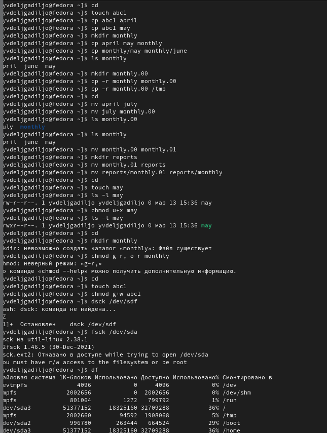

## Скопируем файл /usr/include/sys/io.h в домашний каталог и назовём его equipment.

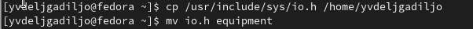

## В домашнем каталоге создадим директорию \~/ski.plases, переместим файл equipment в каталог, а затем переименуем файл \~/ski.plases/equipment в \~/ski.plases/equiplist.

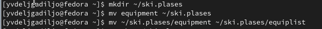

## Создадим в домашнем каталоге файл abc1 и скопируем его в каталог \~/ski.plases, назовем его equiplist2.

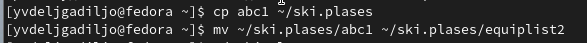

## Создадим каталог с именем equipment в каталоге \~/ski.plases и переместим в него файлы \~/ski.plases/equiplist и equiplist2.

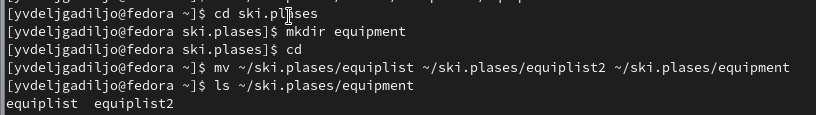

## Создадим и переместим каталог \~/newdir в каталог \~/ski.plases и назовём его plans.

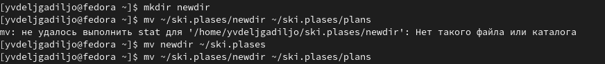

## Определим опции команды chmod

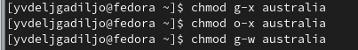

## Просмотрим содержимое файла /etc/password. (такого файла нет)

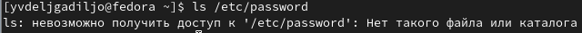

## Скопируем файл \~/feathers в файл \~/file.old, переместим файл \~/file.old в каталог \~/play и скопируем каталог \~/play в каталог \~/fun.

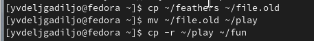

## Переместим каталог \~/fun в каталог \~/play и назовем его games.

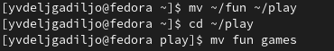

## Лишим владельца файла \~/feathers права на чтение.

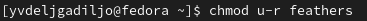

## Лишим владельца каталога \~/play права на выполнение, затем дадим
владельцу каталога \~/play право на выполнение.

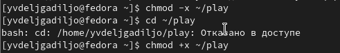

# Результаты

• Я ознакомилась с файловой системой Linux, её структурой, именами и
содержанием каталогов, а также приобрела навыки по применению команд для
работы с файлами и каталогами.

