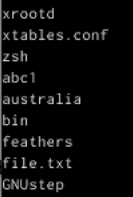

---
## Front matter
lang: ru-RU
title: Лабораторная работа 8
subtitle: Поиск файлов. Перенаправление ввода-вывода. Просмотр запущенных процессов
author:
  - Дельгадильо Валерия
institute:
  - Российский университет дружбы народов, Москва, Россия
  - Объединённый институт ядерных исследований, Дубна, Россия
date: 01 января 1970

## i18n babel
babel-lang: russian
babel-otherlangs: english

## Formatting pdf
toc: false
toc-title: Содержание
slide_level: 2
aspectratio: 169
section-titles: true
theme: metropolis
header-includes:
 - \metroset{progressbar=frametitle,sectionpage=progressbar,numbering=fraction}
 - '\makeatletter'
 - '\beamer@ignorenonframefalse'
 - '\makeatother'
---

# Информация

## Докладчик

  * Дельгадильо Валерия
  * Студент 1го курса НММбд-03-23
  * Российский университет дружбы народов
  * [1032229098@pfur.ru](mailto:1032229098@pfur.ru)
  * <https://github.com/yvdeljgadiljo/study_2023-2024_os-intro>

# Цель работы 
Ознакомиться с инструментами поиска файлов и фильтрации текстовых
данных. Приобрести практические навыки: по управлению процессами (и
заданиями), по проверке использования диска и обслуживанию файловых
систем.

# Лабораторной работы 

## Запишем в файл file.txt названия файлов, содержащихся в каталоге /etc

## Вывод файлов №1

## Допишем в этот же файл названия файлов, содержащихся в домашнем каталоге

## Вывод файлов №2

## С помощью команды cat проверим, что в файле содержатся названия файлов как каталога /etc, так и домашнего каталога

## Выведем имена всех файлов из file.txt, имеющих расширение .conf

## Запишем их в новый текстовой файл conf.txt

## Определим, какие файлы в домашнем каталоге имеют имена, начинающиеся с символа h

## Запустим в фоновом режиме процесс, который будет записывать в файл \~/logfile файлы, имена которых начинаются с log

## С помощью команды jobs проверим, что процесс работает в фоновом режиме

## С помощью команды cat проверим, что в файле содержатся названия файлов, начинающихся на log

## Проверим, что созданный файл logfile находится в домашнем каталоге

## После удаления файла \~/logfile с помощью команды jobs увидим, что процесс всё ещё запущен

## Определим идентификатор процесса gedit, используя команду ps, конвейер и фильтр grep

## Прочтем справку (man) команд df

## Прочтем справку (man) команд du

## Завершим процесс с помощью команды kill, посылая сигнал SIGKILL, имеющий номер 9, процессу 3439

## Выполним команду df

## Выполним команду du

# Результаты

• Я ознакомилась с инструментами поиска файлов и фильтрации текстовых
данных. Приобрести практические навыки: по управлению процессами (и
заданиями), по проверке использования диска и обслуживанию файловых
систем.

