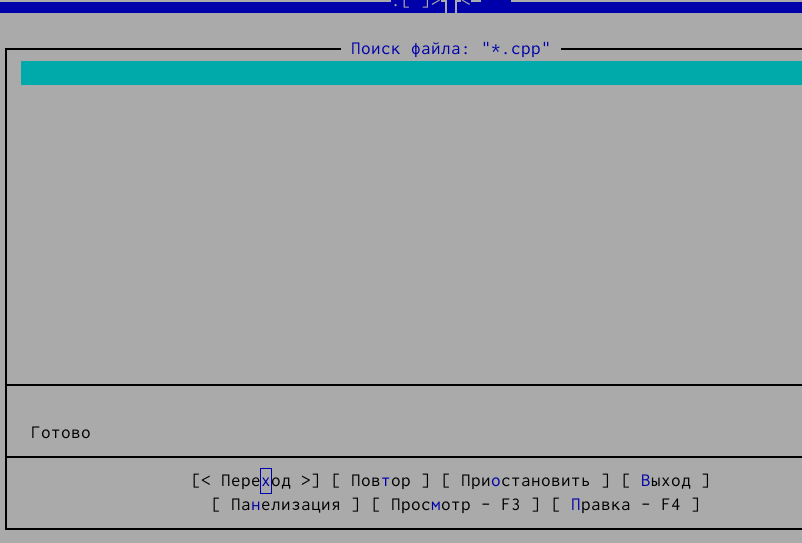
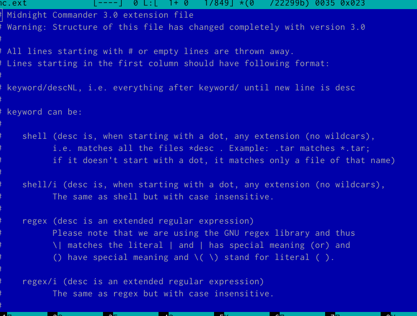
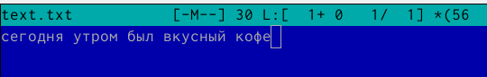
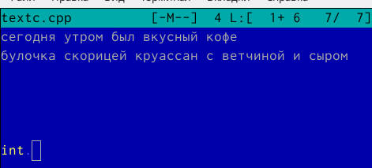

---
## Front matter
title: "Oтчёта по лабораторной работе 9"
subtitle: "Командная оболочка Midnight Commander"
author: " Дельгадильо Валерия"

## Generic otions
lang: ru-RU
toc-title: "Содержание"

## Bibliography
bibliography: bib/cite.bib
csl: pandoc/csl/gost-r-7-0-5-2008-numeric.csl

## Pdf output format
toc: true # Table of contents
toc-depth: 2
lof: true # List of figures
lot: true # List of tables
fontsize: 12pt
linestretch: 1.5
papersize: a4
documentclass: scrreprt
## I18n polyglossia
polyglossia-lang:
  name: russian
  options:
	- spelling=modern
	- babelshorthands=true
polyglossia-otherlangs:
  name: english
## I18n babel
babel-lang: russian
babel-otherlangs: english
## Fonts
mainfont: PT Sans
romanfont: PT Sans
sansfont: PT Sans
monofont: PT Sans
mainfontoptions: Ligatures=TeX
romanfontoptions: Ligatures=TeX
sansfontoptions: Ligatures=TeX,Scale=MatchLowercase
monofontoptions: Scale=MatchLowercase,Scale=0.9
## Biblatex
biblatex: true
biblio-style: "gost-numeric"
biblatexoptions:
  - parentracker=true
  - backend=biber
  - hyperref=auto
  - language=auto
  - autolang=other*
  - citestyle=gost-numeric
## Pandoc-crossref LaTeX customization
figureTitle: "Рис."
tableTitle: "Таблица"
listingTitle: "Листинг"
lofTitle: "Список иллюстраций"
lotTitle: "Список таблиц"
lolTitle: "Листинги"
## Misc options
indent: true
header-includes:
  - \usepackage{indentfirst}
  - \usepackage{float} # keep figures where there are in the text
  - \floatplacement{figure}{H} # keep figures where there are in the text
---
# Цель работы 

Освоить основные возможности командной оболочки Midnight Commander.
Приобрести навыки практической работы по просмотру каталогов и файлов, а
также манипуляций с ними.

# Задание

- Выполнить задания по mc

- Создать отчет и презентацию в md

- Загрузить скринкасты

# Лабораторной работы 

{width="5.833333333333333in"
height="3.9495002187226596in"}

{width="5.800503062117236in"
height="3.816996937882765in"}

Выполним несколько операций в mc, используя управляющие клавиши:

{width="6.467226596675416in"
height="5.21711832895888in"}

{width="5.792168635170603in"
height="3.791994750656168in"}

{width="5.917179571303587in"
height="3.816996937882765in"}

{width="5.800503062117236in"
height="3.858667979002625in"}

{width="5.800503062117236in"
height="3.8086636045494315in"}

{width="5.808836395450569in"
height="3.833665791776028in"}

{width="5.808836395450569in"
height="3.850333552055993in"}

{width="5.833333333333333in"
height="3.9495002187226596in"}

{width="4.80875in"
height="2.050177165354331in"}

{width="5.833333333333333in"
height="3.9495002187226596in"}

{width="5.267122703412073in"
height="1.3584514435695538in"}

{width="5.833333333333333in"
height="4.420903324584427in"}

{width="5.833333333333333in"
height="4.420903324584427in"}

{width="5.767166447944007in"
height="4.5587281277340335in"}

{width="5.833333333333333in"
height="0.9290113735783027in"}

{width="5.833333333333333in"
height="0.9290113735783027in"}

{width="5.833333333333333in"
height="0.9290113735783027in"}

{width="5.833333333333333in"
height="0.9290113735783027in"}

{width="5.833333333333333in"
height="0.9290113735783027in"}

{width="4.267036307961505in"
height="1.091761811023622in"}

{width="5.833333333333333in"
height="3.732826990376203in"}

{width="5.833333333333333in"
height="1.3888888888888888in"}

{width="3.3169542869641293in"
height="0.941748687664042in"}

{width="5.833333333333333in"
height="2.638004155730534in"}

# Выводы

Я освоила основные возможности командной оболочки Midnight Commander и
приобрела навыки практической работы по просмотру каталогов и файлов, а
также манипуляций с ними.

# Список литературы

-   GDB: The GNU Project Debugger. --- URL:
    https://www.gnu.org/software/gdb/.

-   GNU Bash Manual. --- 2016. --- URL:
    https://www.gnu.org/software/bash/manual/.

-   Midnight Commander Development Center. --- 2021. --- URL:
    https://midnight-commander.org/.

-   NASM Assembly Language Tutorials. --- 2021. --- URL:
    https://asmtutor.com/.

-   Newham C. Learning the bash Shell: Unix Shell Programming. ---
    O'Reilly Media, 2005. ---354 с. --- (In a Nutshell). ---
    ISBN 0596009658. --- URL:
    http://www.amazon.com/Learningbash-Shell-Programming-Nutshell/dp/0596009658.

-   Robbins A. Bash Pocket Reference. --- O'Reilly Media, 2016. --- 156
    с. --- ISBN 978-1491941591.

-   The NASM documentation. --- 2021. --- URL:
    https://www.nasm.us/docs.php.

-   Zarrelli G. Mastering Bash. --- Packt Publishing, 2017. --- 502 с.
    --- ISBN 9781784396879.

-   Колдаев В. Д., Лупин С. А. Архитектура ЭВМ. --- М. : Форум, 2018.

-   Куляс О. Л., Никитин К. А. Курс программирования на ASSEMBLER. ---
    М. : Солон-Пресс, 2017.

-   Новожилов О. П. Архитектура ЭВМ и систем. --- М. : Юрайт, 2016.

-   Расширенный ассемблер: NASM. --- 2021. --- URL:
    https://www.opennet.ru/docs/RUS/nasm/.

-   Робачевский А., Немнюгин С., Стесик О. Операционная система UNIX.
    --- 2-е изд. --- БХВПетербург, 2010. --- 656 с. --- ISBN
    978-5-94157-538-1.

-   Столяров А. Программирование на языке ассемблера NASM для ОС Unix.
    --- 2-е изд. --- М. : МАКС Пресс, 2011. --- URL:
    http://www.stolyarov.info/books/asm_unix.

-   Таненбаум Э. Архитектура компьютера. --- 6-е изд. --- СПб. :
    Питер, 2013. --- 874 с. --- (Классика Computer Science).

-   Таненбаум Э., Бос Х. Современные операционн
