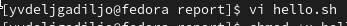
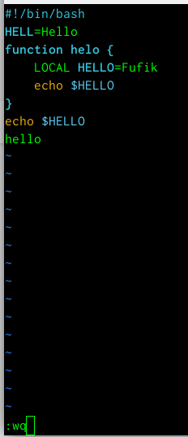
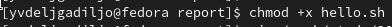
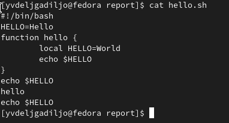

---
## Front matter
lang: ru-RU
title: Лабораторная работа 9
subtitle: Командная оболочка Midnight Commander
author:
  - Дельгадильо Валерия
institute:
  - Российский университет дружбы народов, Москва, Россия
  - Объединённый институт ядерных исследований, Дубна, Россия
date: 01 января 1970

## i18n babel
babel-lang: russian
babel-otherlangs: english

## Formatting pdf
toc: false
toc-title: Содержание
slide_level: 2
aspectratio: 169
section-titles: true
theme: metropolis
header-includes:
 - \metroset{progressbar=frametitle,sectionpage=progressbar,numbering=fraction}
 - '\makeatletter'
 - '\beamer@ignorenonframefalse'
 - '\makeatother'
---

# Информация

## Докладчик

  * Дельгадильо Валерия
  * Студент 1го курса НММбд-03-23
  * Российский университет дружбы народов
  * [1032229098@pfur.ru](mailto:1032229098@pfur.ru)
  * <https://github.com/yvdeljgadiljo/study_2023-2024_os-intro>

# Цель работы 
Освоить основные возможности командной оболочки Midnight Commander.
Приобрести навыки практической работы по просмотру каталогов и файлов, а
также манипуляций с ними.

# Задание

- Выполнить задания по mc

- Создать отчет и презентацию в md

- Загрузить скринкасты

# Лабораторной работы 
##
{width="5.833333333333333in"
height="3.9495002187226596in"}

##
{width="5.800503062117236in"
height="3.816996937882765in"}

##
Выполним несколько операций в mc, используя управляющие клавиши:

{width="6.467226596675416in"
height="5.21711832895888in"}

##
{width="5.792168635170603in"
height="3.791994750656168in"}

##
{width="5.917179571303587in"
height="3.816996937882765in"}

##
{width="5.800503062117236in"
height="3.858667979002625in"}

##
{width="5.800503062117236in"
height="3.8086636045494315in"}

##
{width="5.808836395450569in"
height="3.833665791776028in"}

##
{width="5.808836395450569in"
height="3.850333552055993in"}

##
{width="5.833333333333333in"
height="3.9495002187226596in"}

##
{width="4.80875in"
height="2.050177165354331in"}

##
{width="5.833333333333333in"
height="3.9495002187226596in"}

##
{width="5.267122703412073in"
height="1.3584514435695538in"}

##
{width="5.833333333333333in"
height="4.420903324584427in"}

##
{width="5.833333333333333in"
height="4.420903324584427in"}

##
{width="5.767166447944007in"
height="4.5587281277340335in"}

##
{width="5.833333333333333in"
height="0.9290113735783027in"}

##
{width="5.833333333333333in"
height="0.9290113735783027in"}

##
{width="5.833333333333333in"
height="0.9290113735783027in"}

##
{width="5.833333333333333in"
height="0.9290113735783027in"}

##
{width="5.833333333333333in"
height="0.9290113735783027in"}

##
{width="4.267036307961505in"
height="1.091761811023622in"}

##
{width="5.833333333333333in"
height="3.732826990376203in"}

##
{width="5.833333333333333in"
height="1.3888888888888888in"}

##
{width="3.3169542869641293in"
height="0.941748687664042in"}

##
{width="5.833333333333333in"
height="2.638004155730534in"}

# Результаты

• Я освоила основные возможности командной оболочки Midnight Commander и
приобрела навыки практической работы по просмотру каталогов и файлов, а
также манипуляций с ними.

