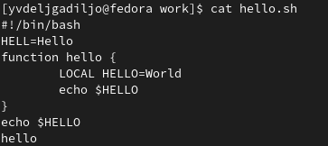

---
## Front matter
lang: ru-RU
title: Лабораторная работа 10
subtitle: Текстовой редактор vi
author:
  - Дельгадильо Валерия
institute:
  - Российский университет дружбы народов, Москва, Россия
  - Объединённый институт ядерных исследований, Дубна, Россия
date: 01 января 1970

## i18n babel
babel-lang: russian
babel-otherlangs: english

## Formatting pdf
toc: false
toc-title: Содержание
slide_level: 2
aspectratio: 169
section-titles: true
theme: metropolis
header-includes:
 - \metroset{progressbar=frametitle,sectionpage=progressbar,numbering=fraction}
 - '\makeatletter'
 - '\beamer@ignorenonframefalse'
 - '\makeatother'
---

# Информация

## Докладчик

  * Дельгадильо Валерия
  * Студент 1го курса НММбд-03-23
  * Российский университет дружбы народов
  * [1032229098@pfur.ru](mailto:1032229098@pfur.ru)
  * <https://github.com/yvdeljgadiljo/study_2023-2024_os-intro>

# Цель работы 

Освоить интерфейс текстового редактора vi.

# Задание

- Выполнить задания по текстовому редактору vi

- Создать отчет и презентацию в md

- Загрузить скринкасты

# Лабораторной работы 
##
{width="2.891917104111986in"
height="0.21668525809273842in"}

##
{width="3.2222222222222223in"
height="7.458333333333333in"}

##
{width="3.266949912510936in"
height="0.2250196850393701in"}

##
{width="3.025262467191601in"
height="1.3501170166229222in"}

##
{width="3.0833333333333335in"
height="7.444444444444445in"}

##
{width="3.183608923884514in"
height="1.7084809711286089in"}

# Результаты

Я освоила интерфейс текстового редактора vi, работая с файлом и
командной строкой.

