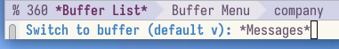

---
## Front matter
lang: ru-RU
title: Лабораторная работа 11
subtitle: Текстовой редактор emacs
author:
  - Дельгадильо Валерия
institute:
  - Российский университет дружбы народов, Москва, Россия
  - Объединённый институт ядерных исследований, Дубна, Россия
date: 01 января 1970

## i18n babel
babel-lang: russian
babel-otherlangs: english

## Formatting pdf
toc: false
toc-title: Содержание
slide_level: 2
aspectratio: 169
section-titles: true
theme: metropolis
header-includes:
 - \metroset{progressbar=frametitle,sectionpage=progressbar,numbering=fraction}
 - '\makeatletter'
 - '\beamer@ignorenonframefalse'
 - '\makeatother'
---

# Информация

## Докладчик

  * Дельгадильо Валерия
  * Студент 1го курса НММбд-03-23
  * Российский университет дружбы народов
  * [1032229098@pfur.ru](mailto:1032229098@pfur.ru)
  * <https://github.com/yvdeljgadiljo/study_2023-2024_os-intro>

# Цель работы 

Познакомиться с операционной системой Linux. Получить практические
навыки работы с редактором Emacs.

# Задание

Ознакомиться с теоретическим материалом. Ознакомиться с редактором
emacs. Выполнить упражнения. Ответить на контрольные вопросы.

# Лабораторной работы 
##Откроем emacs
{width="3.942007874015748in"
height="0.6917268153980752in"}

## Создадим файл lab11.sh с помощью комбинации (C-x C-f)

{width="2.8194444444444446in"
height="2.638888888888889in"}

## Выведем список активных буферов на экран (C-x C-b):

{width="5.833333333333333in"
height="2.4430949256342958in"}

## Переместимся во вновь открытое окно (C-x) o со списком открытых буферов и переключимся на другой буфер.

{width="5.291666666666667in"
height="0.7638888888888888in"}

## Поделим фрейм на 4 части: разделим фрейм на два окна по вертикали (C-x 3), а затем каждое из этих окон на две части по горизонтали (C-x 2)

{width="5.833333333333333in"
height="5.304631452318461in"}

## В каждом из четырёх созданных окон откроем новый буфер (файл) и введем несколько строк текста

{width="5.833333333333333in"
height="5.2129483814523185in"}

## Перейдем в режим поиска и замены (M-%) и заменим слово в файле.

{width="4.75in"
height="5.666666666666667in"}

##
{width="4.75in"
height="2.375in"}

# Результаты
Я ознакомилась с операционной системой Linux и получила практические
навыки работы с редактором Emacs.

