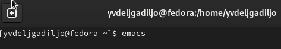
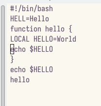
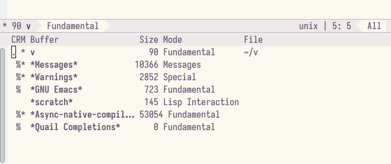
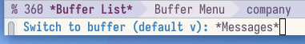
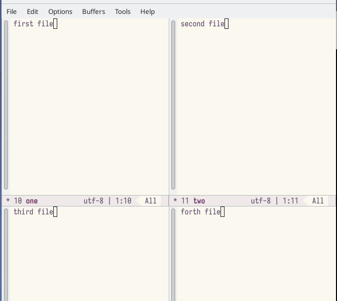

---
## Front matter
title: "Oтчёта по лабораторной работе 11"
subtitle: Текстовой редактор emacs"
author: " Дельгадильо Валерия"

## Generic otions
lang: ru-RU
toc-title: "Содержание"

## Bibliography
bibliography: bib/cite.bib
csl: pandoc/csl/gost-r-7-0-5-2008-numeric.csl

## Pdf output format
toc: true # Table of contents
toc-depth: 2
lof: true # List of figures
lot: true # List of tables
fontsize: 12pt
linestretch: 1.5
papersize: a4
documentclass: scrreprt
## I18n polyglossia
polyglossia-lang:
  name: russian
  options:
	- spelling=modern
	- babelshorthands=true
polyglossia-otherlangs:
  name: english
## I18n babel
babel-lang: russian
babel-otherlangs: english
## Fonts
mainfont: PT Sans
romanfont: PT Sans
sansfont: PT Sans
monofont: PT Sans
mainfontoptions: Ligatures=TeX
romanfontoptions: Ligatures=TeX
sansfontoptions: Ligatures=TeX,Scale=MatchLowercase
monofontoptions: Scale=MatchLowercase,Scale=0.9
## Biblatex
biblatex: true
biblio-style: "gost-numeric"
biblatexoptions:
  - parentracker=true
  - backend=biber
  - hyperref=auto
  - language=auto
  - autolang=other*
  - citestyle=gost-numeric
## Pandoc-crossref LaTeX customization
figureTitle: "Рис."
tableTitle: "Таблица"
listingTitle: "Листинг"
lofTitle: "Список иллюстраций"
lotTitle: "Список таблиц"
lolTitle: "Листинги"
## Misc options
indent: true
header-includes:
  - \usepackage{indentfirst}
  - \usepackage{float} # keep figures where there are in the text
  - \floatplacement{figure}{H} # keep figures where there are in the text
---
# Цель работы 

Познакомиться с операционной системой Linux. Получить практические
навыки работы с редактором Emacs.

# Задание

Ознакомиться с теоретическим материалом. Ознакомиться с редактором
emacs. Выполнить упражнения. Ответить на контрольные вопросы.

# Лабораторной работы 

{width="3.942007874015748in"
height="0.6917268153980752in"}

Создадим файл lab11.sh с помощью комбинации (C-x C-f)

{width="2.8194444444444446in"
height="2.638888888888889in"}

Сохраним файл с помощью комбинации Ctrl-x Ctrl-s (C-x C-s)

Выполним следующие действия над текстом:

1.  Вырежем одной командой целую строку (С-k).
2.  Вставим эту строку в конец файла (C-y).
3.  Выделим область текста (C-space).
4.  Скопировать область в буфер обмена (M-w).
5.  Вставить область в конец файла.
6.  Вновь выделить эту область и на этот раз вырезать её (C-w).
7.  Отмените последнее действие (C-/).

{width="2.888888888888889in"
height="3.0416666666666665in"}

Научились использовать команды по перемещению курсора.

Выведем список активных буферов на экран (C-x C-b):

{width="5.833333333333333in"
height="2.4430949256342958in"}

Переместимся во вновь открытое окно (C-x) o со списком открытых буферов
и переключимся на другой буфер.

{width="5.291666666666667in"
height="0.7638888888888888in"}

Переключаемся между буферами, но уже без вывода их списка на экран (C-x b).

Поделим фрейм на 4 части: разделим фрейм на два окна по вертикали (C-x 3), а затем каждое из этих окон на две части по горизонтали (C-x 2)

{width="5.833333333333333in"
height="5.304631452318461in"}

В каждом из четырёх созданных окон откроем новый буфер (файл) и введем
несколько строк текста

{width="5.833333333333333in"
height="5.2129483814523185in"}

Переключимся в режим поиска (C-s) и найдем несколько слов,
присутствующих в тексте, переключаясь между результатами поиска, нажимая
C-s. (выход С-g)

Перейдем в режим поиска и замены (M-%) и заменим слово в файле.

{width="4.75in"
height="5.666666666666667in"}

{width="4.75in"
height="2.375in"}

Испробуем другой режим поиска, нажав M-s o. Он ищет первое совпадение
после курсора.

# Ответы на контрольные вопросы

1.  Кратко охарактеризуйте редактор emacs.

*Ответ*: emacs --- экранный редактор текста.

2.  Какие особенности данного редактора могут сделать его сложным для
    освоения новичком?

*Ответ*: совершенно не поддающиеся какой бы то ни было логике сочетания
клавиш поставят любого пользователя в тупик. Удачи.

3.  Своими словами опишите, что такое буфер и окно в терминологии
    emacs'а.

*Ответ*: буфер --- хранилище текста, окно --- хранилище буферов.

4.  Можно ли открыть больше 10 буферов в одном окне?

*Ответ*: оказалось, что нет.

5.  Какие буферы создаются по умолчанию при запуске emacs?

*Ответ*: 'GNU Emacs' и \*Warnings\*.

6.  Какие клавиши вы нажмёте, чтобы ввести следующую комбинацию C-c \| и
    C-c C-\|?

*Ответ*: `ctrl-c-shift-\` и `ctrl-c ctrl-shift-\`.

7.  Как поделить текущее окно на две части?

*Ответ*: по горизонтали (`C-x 2`) и вертикали (`C-x 3`).

8.  В каком файле хранятся настройки редактора emacs?

*Ответ*: `~/.emacs`.

9.  Какую функцию выполняет клавиша и можно ли её переназначить?

*Ответ*: перемещение каретки по буферу. Переназначить нельзя.

10. Какой редактор вам показался удобнее в работе vi или emacs? Поясните
    почему.

*Ответ*: vi оказался удобнее ввиду своей легковесности.

# Выводы

Я ознакомилась с операционной системой Linux и получила практические
навыки работы с редактором Emacs.

# Список литературы

-   GDB: The GNU Project Debugger. --- URL:
    https://www.gnu.org/software/gdb/.

-   GNU Bash Manual. --- 2016. --- URL:
    https://www.gnu.org/software/bash/manual/.

-   Midnight Commander Development Center. --- 2021. --- URL:
    https://midnight-commander.org/.

-   NASM Assembly Language Tutorials. --- 2021. --- URL:
    https://asmtutor.com/.

-   Newham C. Learning the bash Shell: Unix Shell Programming. ---
    O'Reilly Media, 2005. ---354 с. --- (In a Nutshell). ---
    ISBN 0596009658. --- URL:
    http://www.amazon.com/Learningbash-Shell-Programming-Nutshell/dp/0596009658.

-   Robbins A. Bash Pocket Reference. --- O'Reilly Media, 2016. --- 156
    с. --- ISBN 978-1491941591.

-   The NASM documentation. --- 2021. --- URL:
    https://www.nasm.us/docs.php.

-   Zarrelli G. Mastering Bash. --- Packt Publishing, 2017. --- 502 с.
    --- ISBN 9781784396879.

-   Колдаев В. Д., Лупин С. А. Архитектура ЭВМ. --- М. : Форум, 2018.

-   Куляс О. Л., Никитин К. А. Курс программирования на ASSEMBLER. ---
    М. : Солон-Пресс, 2017.

-   Новожилов О. П. Архитектура ЭВМ и систем. --- М. : Юрайт, 2016.

-   Расширенный ассемблер: NASM. --- 2021. --- URL:
    https://www.opennet.ru/docs/RUS/nasm/.

-   Робачевский А., Немнюгин С., Стесик О. Операционная система UNIX.
    --- 2-е изд. --- БХВПетербург, 2010. --- 656 с. --- ISBN
    978-5-94157-538-1.

-   Столяров А. Программирование на языке ассемблера NASM для ОС Unix.
    --- 2-е изд. --- М. : МАКС Пресс, 2011. --- URL:
    http://www.stolyarov.info/books/asm_unix.

-   Таненбаум Э. Архитектура компьютера. --- 6-е изд. --- СПб. :
    Питер, 2013. --- 874 с. --- (Классика Computer Science).

-   Таненбаум Э., Бос Х. Современные операционн
