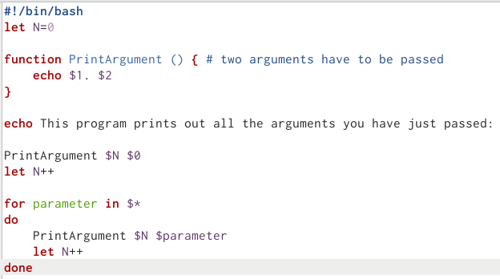
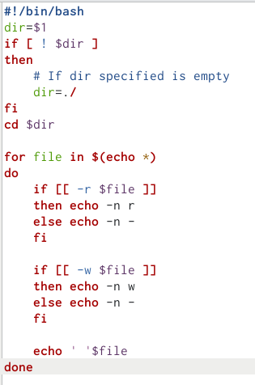
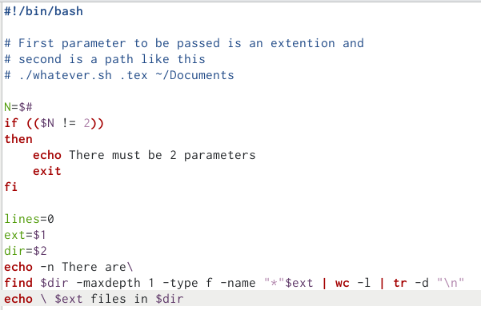

---
## Front matter
lang: ru-RU
title: Лабораторная работа 12
subtitle: Программирование в командной процессоре ОС UNIX. Командные файлы
author:
  - Дельгадильо Валерия
institute:
  - Российский университет дружбы народов, Москва, Россия
  - Объединённый институт ядерных исследований, Дубна, Россия
date: 01 января 1970

## i18n babel
babel-lang: russian
babel-otherlangs: english

## Formatting pdf
toc: false
toc-title: Содержание
slide_level: 2
aspectratio: 169
section-titles: true
theme: metropolis
header-includes:
 - \metroset{progressbar=frametitle,sectionpage=progressbar,numbering=fraction}
 - '\makeatletter'
 - '\beamer@ignorenonframefalse'
 - '\makeatother'
---

# Информация

## Докладчик

  * Дельгадильо Валерия
  * Студент 1го курса НММбд-03-23
  * Российский университет дружбы народов
  * [1032229098@pfur.ru](mailto:1032229098@pfur.ru)
  * <https://github.com/yvdeljgadiljo/study_2023-2024_os-intro>

# Цель работы 

Цель работы --- изучить основы программирования в командной оболочке OS
Unix.

# Лабораторной работы 

## Программа №1

{width="4.083333333333333in"
height="1.8894925634295714in"}

## Программа №2

{width="4.083333333333333in"
height="2.2772430008748907in"}

## Программа №3

{width="4.083333333333333in"
height="6.170369641294839in"}

## Программа №4
{width="4.083333333333333in"
height="2.6361614173228345in"}

# Результаты

В ходе выполнения лабораторной работы были изучены основы
программирования в командной оболочке OS Unix. Цель работы была
достигнута.

