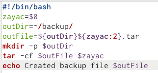
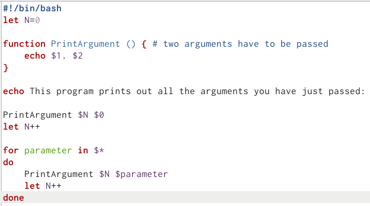
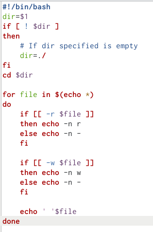
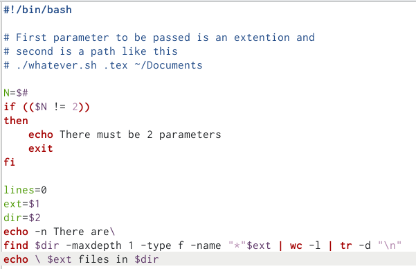

---
## Front matter
title: "Oтчёта по лабораторной работе 12"
subtitle: "Программирование в командной процессоре ОС UNIX. Командные файлы"
author: " Дельгадильо Валерия"

## Generic otions
lang: ru-RU
toc-title: "Содержание"

## Bibliography
bibliography: bib/cite.bib
csl: pandoc/csl/gost-r-7-0-5-2008-numeric.csl

## Pdf output format
toc: true # Table of contents
toc-depth: 2
lof: true # List of figures
lot: true # List of tables
fontsize: 12pt
linestretch: 1.5
papersize: a4
documentclass: scrreprt
## I18n polyglossia
polyglossia-lang:
  name: russian
  options:
	- spelling=modern
	- babelshorthands=true
polyglossia-otherlangs:
  name: english
## I18n babel
babel-lang: russian
babel-otherlangs: english
## Fonts
mainfont: PT Sans
romanfont: PT Sans
sansfont: PT Sans
monofont: PT Sans
mainfontoptions: Ligatures=TeX
romanfontoptions: Ligatures=TeX
sansfontoptions: Ligatures=TeX,Scale=MatchLowercase
monofontoptions: Scale=MatchLowercase,Scale=0.9
## Biblatex
biblatex: true
biblio-style: "gost-numeric"
biblatexoptions:
  - parentracker=true
  - backend=biber
  - hyperref=auto
  - language=auto
  - autolang=other*
  - citestyle=gost-numeric
## Pandoc-crossref LaTeX customization
figureTitle: "Рис."
tableTitle: "Таблица"
listingTitle: "Листинг"
lofTitle: "Список иллюстраций"
lotTitle: "Список таблиц"
lolTitle: "Листинги"
## Misc options
indent: true
header-includes:
  - \usepackage{indentfirst}
  - \usepackage{float} # keep figures where there are in the text
  - \floatplacement{figure}{H} # keep figures where there are in the text
---
# Цель работы 

Цель работы --- изучить основы программирования в командной оболочке OS
Unix.

# Лабораторной работы 

1.  Написать скрипт, который при запуске будет делать резервную копию
    самого себя (то есть файла, в котором содержится его исходный код) в
    другую директорию backup в вашем домашнем каталоге. При этом файл
    должен архивироваться одним из архиваторов на выбор zip, bzip2 или
    tar. Способ использования команд архивации необходимо узнать, изучив
    справку.

{width="4.083333333333333in"
height="1.8894925634295714in"}

2.  Написать пример командного файла, обрабатывающего любое произвольное
    число аргументов командной строки, в том числе превышающее десять.
    Например, скрипт может последовательно распечатывать значения всех
    переданных аргументов.

{width="4.083333333333333in"
height="2.2772430008748907in"}

3.  Написать командный файл --- аналог команды ls (без использования
    самой этой команды и команды dir). Требуется, чтобы он выдавал
    информацию о нужном каталоге и выводил информацию о возможностях
    доступа к файлам этого каталога.

{width="4.083333333333333in"
height="6.170369641294839in"}

4.  Написать командный файл, который получает в качестве аргумента
    командной строки формат файла (.txt, .doc, .jpg, .pdf и т.д.) и
    вычисляет количество таких файлов в указанной директории. Путь к
    директории также передаётся в виде аргумента командной строки.

{width="4.083333333333333in"
height="2.6361614173228345in"}

## Ответы на контрольные вопросы

2.  Объясните понятие командной оболочки. Приведите примеры командных
    оболочек. Чем они отличаются?

*Ответ*: командная оболочка позволяет исполнять команды.

3.  Что такое POSIX?

*Ответ*: POSIX --- набор стандартов описания интерфейсов взаимодействия
операционной системы и прикладных программ.

4.  Как определяются переменные и массивы в языке программирования bash?

*Ответ*: через равно.

5.  Каково назначение операторов let и read?

*Ответ*: let позволяет выполнять арифметические операции при задании
переменных, read считывает стандартный поток вывода.

5.  Какие арифметические операции можно применять в языке
    программирования bash?

*Ответ*: стандартные.

6.  Что означает операция (( ))?

*Ответ*: (( )) вычисляют логические условные выражения.

7.  Какие стандартные имена переменных Вам известны?

*Ответ*: PATH, ENV, TERM.

8.  Что такое метасимволы?

*Ответ*: специальные символы.

9.  Как экранировать метасимволы?

*Ответ*: как угодно, но можно через .

10. Как создавать и запускать командные файлы?

*Ответ*: для создания файла применить команду
`touch <file> && chmod +x <file>`. Для запуска ввести `./<file>`

11. Как определяются функции в языке программирования bash?

*Ответ*: при помощи ключевого слова `function`.

12. Каким образом можно выяснить, является файл каталогом или обычным
    файлом?

*Ответ*: ls -l выведет дополнительную информацию.

13. Каково назначение команд set, typeset и unset?

*Ответ*: таково: изменение значения внутренних переменных сценария,
наложение ограничений на переменные, удаление переменной.

14. Как передаются параметры в командные файлы?

*Ответ*: через пробел при запуске программы.

15. Назовите специальные переменные языка bash и их назначение.

*Ответ*: см. вопрос 7.

# Выводы

В ходе выполнения лабораторной работы были изучены основы
программирования в командной оболочке OS Unix. Цель работы была
достигнута.

# Список литературы

-   GDB: The GNU Project Debugger. --- URL:
    https://www.gnu.org/software/gdb/.

-   GNU Bash Manual. --- 2016. --- URL:
    https://www.gnu.org/software/bash/manual/.

-   Midnight Commander Development Center. --- 2021. --- URL:
    https://midnight-commander.org/.

-   NASM Assembly Language Tutorials. --- 2021. --- URL:
    https://asmtutor.com/.

-   Newham C. Learning the bash Shell: Unix Shell Programming. ---
    O'Reilly Media, 2005. ---354 с. --- (In a Nutshell). ---
    ISBN 0596009658. --- URL:
    http://www.amazon.com/Learningbash-Shell-Programming-Nutshell/dp/0596009658.

-   Robbins A. Bash Pocket Reference. --- O'Reilly Media, 2016. --- 156
    с. --- ISBN 978-1491941591.

-   The NASM documentation. --- 2021. --- URL:
    https://www.nasm.us/docs.php.

-   Zarrelli G. Mastering Bash. --- Packt Publishing, 2017. --- 502 с.
    --- ISBN 9781784396879.

-   Колдаев В. Д., Лупин С. А. Архитектура ЭВМ. --- М. : Форум, 2018.

-   Куляс О. Л., Никитин К. А. Курс программирования на ASSEMBLER. ---
    М. : Солон-Пресс, 2017.

-   Новожилов О. П. Архитектура ЭВМ и систем. --- М. : Юрайт, 2016.

-   Расширенный ассемблер: NASM. --- 2021. --- URL:
    https://www.opennet.ru/docs/RUS/nasm/.

-   Робачевский А., Немнюгин С., Стесик О. Операционная система UNIX.
    --- 2-е изд. --- БХВПетербург, 2010. --- 656 с. --- ISBN
    978-5-94157-538-1.

-   Столяров А. Программирование на языке ассемблера NASM для ОС Unix.
    --- 2-е изд. --- М. : МАКС Пресс, 2011. --- URL:
    http://www.stolyarov.info/books/asm_unix.

-   Таненбаум Э. Архитектура компьютера. --- 6-е изд. --- СПб. :
    Питер, 2013. --- 874 с. --- (Классика Computer Science).

-   Таненбаум Э., Бос Х. Современные операционн
