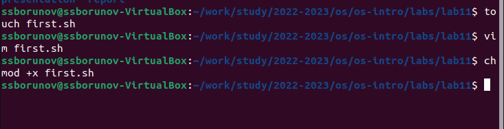
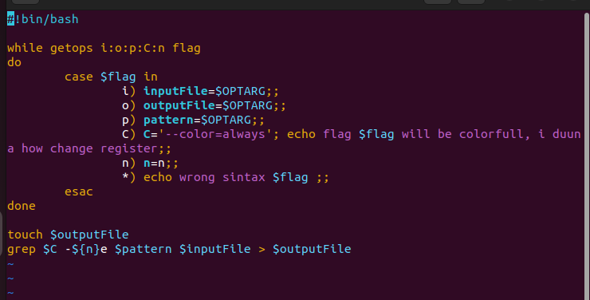
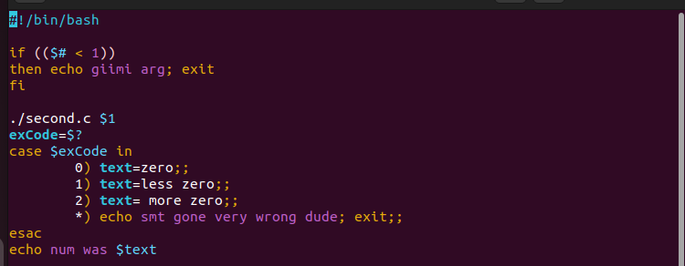

---
## Front matter
lang: ru-RU
title: Отчет по лабораторной
subtitle: номер 11
author:
  - Дельгадильо В.
institute:
  - Российский университет дружбы народов, Москва, Россия
date: 01 января 1970

## i18n babel
babel-lang: russian
babel-otherlangs: english

## Formatting pdf
toc: false
toc-title: Содержание
slide_level: 2
aspectratio: 169
section-titles: true
theme: metropolis
header-includes:
 - \metroset{progressbar=frametitle,sectionpage=progressbar,numbering=fraction}
 - '\makeatletter'
 - '\beamer@ignorenonframefalse'
 - '\makeatother'
---

## Цели и задачи

Цель работы — изучить основы программирования в командной оболочке OS Unix.

## Задание 1
Создадим файл для программы, откроем его в тектовом редакторе, наберем код, выдадим нужные права доступа

{#fig:001 width=70%}

## Задание 2.1
Задание 1 выполняет код на 

{#fig:002 width=70%}

## задание 2.2

Далее создадим 2 файла для задачи 2. На рисунке приведен код на языке bash.

{#fig:003 width=70%}

## Выводы

В ходе выполнения лабораторной работы были изучены основы программирования в командной оболочке OS Unix.

