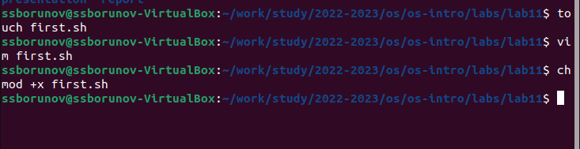
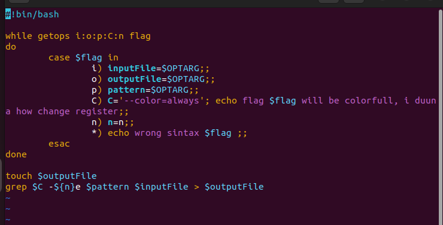
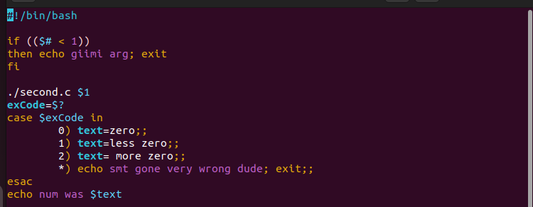

---
## Front matter
title: "Отчёт по лабораторной работе"
subtitle: "Номер 11"
author: "Дельгадильо Валерия"

## Generic otions
lang: ru-RU
toc-title: "Содержание"

## Bibliography
bibliography: bib/cite.bib
csl: pandoc/csl/gost-r-7-0-5-2008-numeric.csl

## Pdf output format
toc: true # Table of contents
toc-depth: 2
lof: true # List of figures
lot: true # List of tables
fontsize: 12pt
linestretch: 1.5
papersize: a4
documentclass: scrreprt
## I18n polyglossia
polyglossia-lang:
  name: russian
  options:
	- spelling=modern
	- babelshorthands=true
polyglossia-otherlangs:
  name: english
## I18n babel
babel-lang: russian
babel-otherlangs: english
## Fonts
mainfont: PT Serif
romanfont: PT Serif
sansfont: PT Sans
monofont: PT Mono
mainfontoptions: Ligatures=TeX
romanfontoptions: Ligatures=TeX
sansfontoptions: Ligatures=TeX,Scale=MatchLowercase
monofontoptions: Scale=MatchLowercase,Scale=0.9
## Biblatex
biblatex: true
biblio-style: "gost-numeric"
biblatexoptions:
  - parentracker=true
  - backend=biber
  - hyperref=auto
  - language=auto
  - autolang=other*
  - citestyle=gost-numeric
## Pandoc-crossref LaTeX customization
figureTitle: "Рис."
tableTitle: "Таблица"
listingTitle: "Листинг"
lofTitle: "Список иллюстраций"
lotTitle: "Список таблиц"
lolTitle: "Листинги"
## Misc options
indent: true
header-includes:
  - \usepackage{indentfirst}
  - \usepackage{float} # keep figures where there are in the text
  - \floatplacement{figure}{H} # keep figures where there are in the text
---

# Цель работы

Цель работы — изучить основы программирования в командной оболочке OS Unix.


# Выполнение лабораторной работы

Создадим файл для программы, откроем его в тектовом редакторе, наберем код, выдадим нужные права доступа(рис. @fig:001).

{#fig:001 width=70%}

Задание 1 выполняет код на (рис. @fig:002).

{#fig:002 width=70%}
так же листинг программы
```bash
#! /bin/bash

while getops i:o:p:C:n flag
do
	case $flag in
		i) inputFile=$OPTARG;;
		o) outputFile=$OPTARG;;
		p) pattern=$OPTARG;;
		C) C='--color=always'; echo flag $flag will be colorfull, i duuna how change register;;
		n) n=n;;
		*) echo wrong sintax $flag ;;
	esac
done

touch $outputFile
grep $C -${n}e $pattern $inputFile > $outputFile
```

Далее создадим 2 файла для задачи 2. На (рис. @fig:003) приведен код на языке bash.

{#fig:003 width=70%}

код на си для задачи 
```c
#include <stdio.h>

int main(int argc, char* argv[])
{
	char* x = argv[1];
	int i = atoi(x);

	if (i<0) {exit(1)}
	else if (i>0) {exit(2)}
	exit(0)
}
```
код на bash
```bash
#!/bin/bash

if (($# < 1))
then echo giimi arg; exit
fi

./second.c $1
exCode=$?
case $exCode in
	0) text=zero;;
	1) text=less zero;;
	2) text= more zero;;
	*) echo smt gone very wrong dude; exit;;
esac
echo num was $text
```

# Выводы

В ходе выполнения лабораторной работы были изучены основы программирования в командной оболочке OS Unix.

